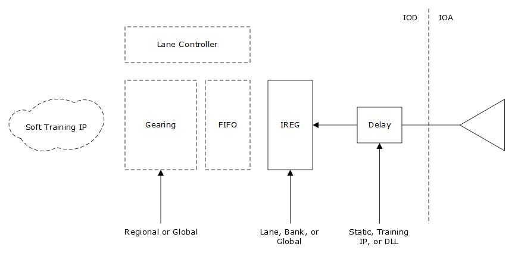

# Input Gear Box

The IGEAR is composed of three sets of data registers to de-serialize the input data and transfer it to a lower core speed. It uses three sets of registers:

-   Shift: running on the high-speed input clock.
-   Update: running on the high-speed input clock, but controlled by an update signal from the clock controller. The update is based on the de-serialization mode required to reduce the frequency to the core speed \(X2, X3.5, X4, and X5\).
-   Transfer: running on the core system clock. It is required to guarantee timing is met in the transition from the update register to the system clock.

**Parent topic:**[Software Primitives](GUID-3F64B9AB-0327-4CAD-A811-E9D6B90377D3.md)

