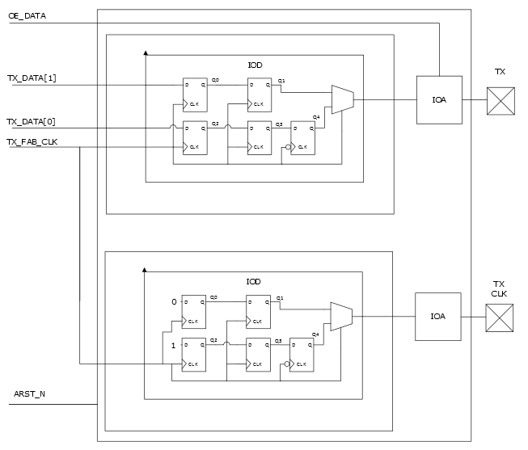

# TX\_DDR\_G/B\_A

The TX\_DDR\_G \_A interfaces implement the DDR transmit interface where clock  edges are aligned with the DDR data. The IOD block uses the fabric clock \(TX\_FAB\_CLK\)  that is routed on a global clock resource to capture the transmitted data from fabric  and transmit it through the TX pin.

The following figure shows the TX\_DDR\_G\_A interface signal waveform.

The following figure shows the block diagram of the TX\_DDR\_G\_A interface.

**Parent topic:**[TX DDR Interfaces](GUID-CB8D7DD7-07C8-41AE-BB32-31858BA4DAD2.md)

