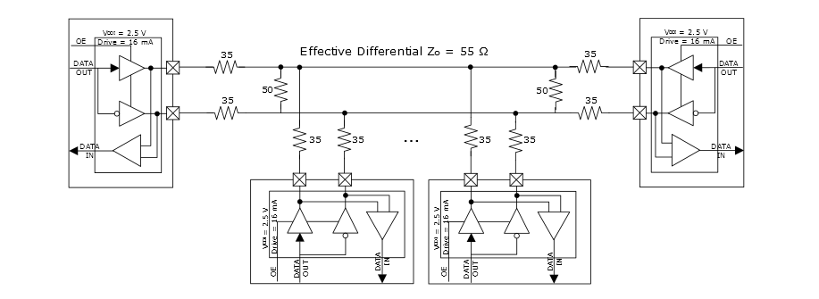

# Multipoint Low-Voltage Emulated \(MLVDSE25\) Output Mode

MLVDS has larger signaling amplitude when compared to BLVDS, and therefore, it  requires more drive current. Similar to BLVDS, the effective impedance of these systems  is lower than a typical pair of PCB traces due to backplane capacitance, the connectors  on the backplane, and the line stubs. The following illustration shows an example  implementation using 35Ω stub resistors at every drop and 50Ω stub resistors on either  side of the bus. The termination values at the ends of the bus, which can range anywhere  between 50Ω and 70Ω, must be optimized to match the effective differential impedance of  the bus.

**Parent topic:**[Implementing Emulated Standards for Outputs](GUID-CEDCE521-84AB-4ACB-9B30-7E70F1D7BAB1.md)

