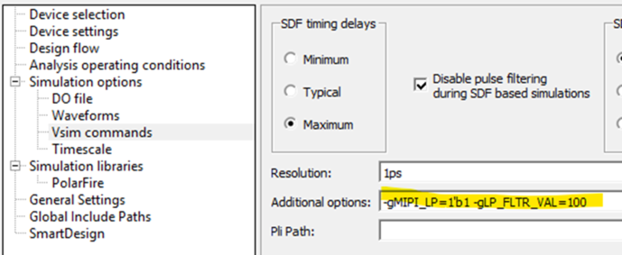

# MIPI D-PHY Transmit Only \(High-Speed and Low-Power\)

The MIPI Low-power \(LP\) transmit signaling uses pins located in either GPIO or<br /> HSIO banks using 1.2V VDDI I/O bank supply using LVCMOS12 outputs. High-speed MIPI transmit<br /> signals must be in GPIO bank using a 2.5V VDDI I/O bank supply using MIPIE25 emulated<br /> differential output drivers. The MIPI TX standards are implemented by using the resistor<br /> divider network for LP and High-speed \(HS\) signals, as shown in the following figure. For<br /> required pin-out planning of the HS and LP Tx pins. See respective [PolarFire FPGA Board Design User Guide](https://ww1.microchip.com/downloads/aemDocuments/documents/FPGA/ProductDocuments/UserGuides/PolarFire_FPGA_Board_Design_UG0726_V11.pdf), [PolarFire SoC FPGA Board Design Guidelines User Guide](https://ww1.microchip.com/downloads/aemDocuments/documents/FPGA/ProductDocuments/UserGuides/PolarFire_SoC_FPGA_Board_Design_Guidelines_User_Guide_VB.pdf), [RT PolarFire FPGA Board Design User Guide](https://ww1.microchip.com/downloads/aemDocuments/documents/FPGA/ProductDocuments/UserGuides/RT_PolarFire_Board_Design_User_Guide_VA.pdf), or *RT PolarFire SoC FPGA Board Design Guidelines User Guide* \(to be available in<br /> a future release\).

")

**Important:** Resistor value vary based on optimal performance. For resistor specifications, see respective [PolarFire FPGA Board Design User Guide](https://ww1.microchip.com/downloads/aemDocuments/documents/FPGA/ProductDocuments/UserGuides/PolarFire_FPGA_Board_Design_UG0726_V11.pdf), [PolarFire SoC FPGA Board Design Guidelines User Guide](https://ww1.microchip.com/downloads/aemDocuments/documents/FPGA/ProductDocuments/UserGuides/PolarFire_SoC_FPGA_Board_Design_Guidelines_User_Guide_VB.pdf), [RT PolarFire FPGA Board Design User Guide](https://ww1.microchip.com/downloads/aemDocuments/documents/FPGA/ProductDocuments/UserGuides/RT_PolarFire_Board_Design_User_Guide_VA.pdf), or *RT PolarFire SoC FPGA Board Design Guidelines User Guide* \(to be available in a future release\).

MIPI D\_PHY transmits the TXD\_DATA out on to the TXD/TX\_CLK MIPI pins when the HS\_DATA\_SEL/HS\_CLK\_SEL port is asserted controlling the OE of the HS differential driver. The HS\_DATA\_SEL/HS\_CLK\_SEL are optionally configured using the Libero SoC IOD configurator.

When HS\_DATA\_SEL/HS\_CLK\_SEL is asserted, both single-ended LVCMOS12 8 mA drivers are driven low by the IOD to ensure proper level shifting occurs for high-speed operation.

In LP operation, HS\_DATA\_SEL/HS\_CLK\_SEL de-assertion sends the LP\_DATA and LP\_CLK out to the TXLP/TX\_CLK\_LP MIPI pins while the HS\_TX pair is disabled in a High-Z state.

The D-PHY transmit must be interfaced to the MIPI receiver using the terminated interface shown in [Figure   1](#GUID-6B91EBB2-50CE-4FF5-A685-CD75BA632416).

**Important:**

-   During the simulation only, a false scenario is observed, resulting in the low-power \(LP\_DATA\_N\) signal toggling. This impacts the observed functionality of the MIPI RX decoder IP linked to the output of the IOD, during high-speed data. This does not occur in real device operation but is only observed in simulation. On silicon, in low-power mode, the common mode voltage of the differential I/O is lower than the trigger point of LVCMOS12. Therefore, the LP\_DATA\_N signal operates correctly and does not toggle in high-speed mode.
-   During high-speed data transition, if the user does not want the toggling of L0\_LP\_DATA and L0\_LP\_DATA\_N signals of the PF\_IOD\_GENERIC\_RX IP, the user can add the `-gMIPI_LP=1'b1 -gLP_FLTR_VAL=100` Vsim command/arguments in **Libero SoC** &gt; **Project Settings** &gt; **Simulation options** &gt; **Vsim commands** \(see [Figure   2](#FIG_IHT_LM2_S2C)\) as shown in the following figure.

    

    Where,

    -   `MIPI_LP` is the 1’b1 parameter value to activate the filtering logic. The 1’b0 value retains the old functionality as it is. The default is 1’b0.
    -   `LP_FLTR_VAL` is the glitch pulse in nanoseconds to be filtered. The user can change it to any value as required. The default is 100 ns.
-   In a design, if all IODs are not used for MIPI, individual IOD must be controlled by using `defparam` in the user testbench as shown in the following example:

``` {#CODEBLOCK_N2M_FM2_S2C}
parameter MIPI_LP = 1'b1;
parameter LP_FLTR_VAL = 100;

// MIPI_LP for INBUF_DIFF_MIPI
defparam test_tb.top_0.rx_top_0.PF_IOD_GENERIC_RX_C0_0.PF_IOD_RX.I_INBUF_DIFF_MIPI_3.MIPI_LP = MIPI_LP;
defparam test_tb.top_0.rx_top_0.PF_IOD_GENERIC_RX_C0_0.PF_IOD_RX.I_INBUF_DIFF_MIPI_2.MIPI_LP = MIPI_LP;
defparam test_tb.top_0.rx_top_0.PF_IOD_GENERIC_RX_C0_0.PF_IOD_RX.I_INBUF_DIFF_MIPI_1.MIPI_LP = MIPI_LP;
defparam test_tb.top_0.rx_top_0.PF_IOD_GENERIC_RX_C0_0.PF_IOD_RX.I_INBUF_DIFF_MIPI_0.MIPI_LP = MIPI_LP;
// LP_FLTR_VAL for INBUF_DIFF_MIPI
defparam test_tb.top_0.rx_top_0.PF_IOD_GENERIC_RX_C0_0.PF_IOD_RX.I_INBUF_DIFF_MIPI_3.LP_FLTR_VAL = LP_FLTR_VAL;
defparam test_tb.top_0.rx_top_0.PF_IOD_GENERIC_RX_C0_0.PF_IOD_RX.I_INBUF_DIFF_MIPI_2.LP_FLTR_VAL = LP_FLTR_VAL;
defparam test_tb.top_0.rx_top_0.PF_IOD_GENERIC_RX_C0_0.PF_IOD_RX.I_INBUF_DIFF_MIPI_1.LP_FLTR_VAL = LP_FLTR_VAL;
defparam test_tb.top_0.rx_top_0.PF_IOD_GENERIC_RX_C0_0.PF_IOD_RX.I_INBUF_DIFF_MIPI_0.LP_FLTR_VAL = LP_FLTR_VAL;
 
// MIPI_LP for IOD
defparam test_tb.top_0.rx_top_0.PF_IOD_GENERIC_RX_C0_0.PF_IOD_RX.I_IOD_3.MIPI_LP = MIPI_LP;
defparam test_tb.top_0.rx_top_0.PF_IOD_GENERIC_RX_C0_0.PF_IOD_RX.I_IOD_2.MIPI_LP = MIPI_LP;
defparam test_tb.top_0.rx_top_0.PF_IOD_GENERIC_RX_C0_0.PF_IOD_RX.I_IOD_1.MIPI_LP = MIPI_LP;
defparam test_tb.top_0.rx_top_0.PF_IOD_GENERIC_RX_C0_0.PF_IOD_RX.I_IOD_0.MIPI_LP = MIPI_LP;

// LP_FLTR_VAL for IOD
defparam test_tb.top_0.rx_top_0.PF_IOD_GENERIC_RX_C0_0.PF_IOD_RX.I_IOD_3.LP_FLTR_VAL = LP_FLTR_VAL;
defparam test_tb.top_0.rx_top_0.PF_IOD_GENERIC_RX_C0_0.PF_IOD_RX.I_IOD_2.LP_FLTR_VAL = LP_FLTR_VAL;
defparam test_tb.top_0.rx_top_0.PF_IOD_GENERIC_RX_C0_0.PF_IOD_RX.I_IOD_1.LP_FLTR_VAL = LP_FLTR_VAL;
```

**Parent topic:**[Implementing MIPI D-PHY](GUID-01A145E0-6FFC-412D-8258-FBEB32C25B55.md)

