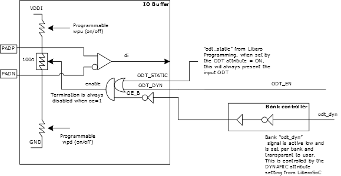

# Dynamic ODT or Fail-Safe LVDS

PolarFire family FPGAs support an internal LVDS fail-safe solution. This<br /> configuration uses a combination of the following device features:

-   Dynamic on-die-termination \(ODT\) access per I/O
-   Weak pull-up/pull-down resistor for differential inputs

When the LVDS input temporarily floats during operation, a bank-level input signal can dynamically turn-off the on-die termination resistor so that each leg of the LVDS pair can only see the weak pull-up and pull-down resistor enabled, creating an LVDS fail-safe input.

The ODT\_EN pin can be exposed for any I/O that subscribes for DYNAMIC ODT<br /> required to be LVDS fail-safe. The user design uses ODT\_DYN\_PIN to switch in or switch out the<br /> differential termination while the weak pull-up resistor I/O attribute is added on PADP of the<br /> LVDS I/O and the PADN is weakly pulled down, automatically. The fail-safe condition has the<br /> ODT disabled leaving the pull resistors to differentially bias the PADP and PADN, preventing<br /> unwanted behavior when not being driven. During normal operation, the internal ODT must be<br /> present for the LVDS receiver.



**Important:** During fail-safe, the weak pull-up and weak pull-down are on all the time. ODT\_DYN\_PIN is used to disable the differential termination when the pads are not driven externally.

I/O configurators that use LVDS input have an option to expose the<br /> **Enable ODT\_EN pin for LVDS Failsafe** option. This is an active high<br /> input that must be driven from the fabric by the user.

Only GPIO has internal 100Ω ODT termination that can be dynamically controlled<br /> by a fabric pin. HSIO requires fixed, external termination<br /> resistor on PCB.

If the dynamic ODT option is enabled in the IO editor or with a PDC<br /> command, the following warning occurs during place and<br /> route:

``` {#MSGBLOCK_I4K_3MQ_RCC}
Warning: Port 'user port name' has the 'On Die Termination' value of DYNAMIC but the ODT_EN pin is connected to a power net on the IOD.
```

**Important:**

-   Differential transceiver reference clock inputs include optional 100Ω differential termination. However, dynamic failsafe is not included. Designs must not allow for XCVR REFCLK P/N pads to float. Unused REFCLK pads must follow the recommendations in the public pin-out assignment tables \(PPAT\).
-   There is a known issue in the Libero SoC I/O Editor and the pin report. A software limitation exists where a design cannot have different values for the P and N sides. Currently, both must have the same value. Libero SoC programs the P and N side correctly for programming. In IOEditor or pin report, if RES\_PULL is up on both, it means the N side is programmed as down or visa-versa.

**Parent topic:**[I/O Implementation Considerations](GUID-984E4773-788B-43B2-8E99-D0C476AC29DD.md)

