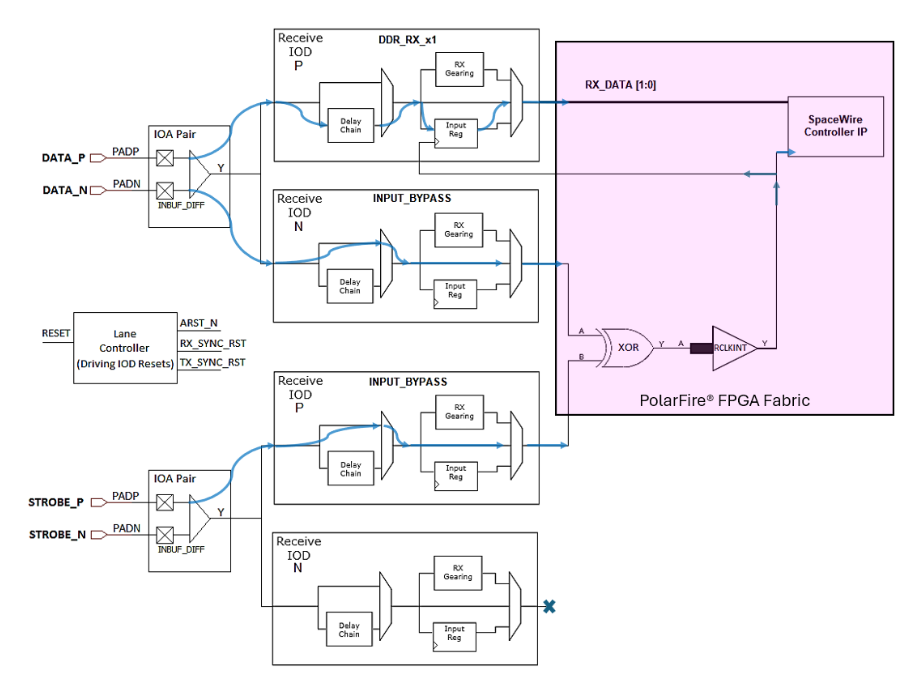
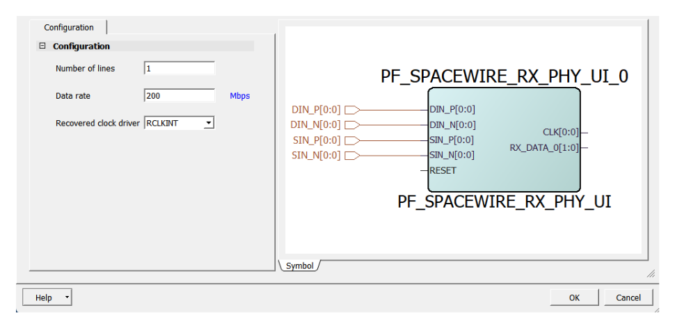

# SpaceWire Clock and Data Recovery \(For RT PolarFire and RT PolarFire SoC FPGA Only\)

SpaceWire is a spacecraft onboard data-handling network that connects instruments to the  mass-memory, data processors, and control processors, which is already in orbit or being  designed into more than 100 spacecrafts. The RT PolarFire and RT PolarFire SoC FPGA does  not have dedicated SpaceWire clock and data recovery circuits like those found on RTG4  FPGAs. The RT PolarFire and RT PolarFire SoC FPGA performs SpaceWire clock recovery  using FPGA fabric logic while delaying the data path in parallel to compensate for the  clock recovery delay.

To implement the SpaceWire RX PHY in the RT PolarFire and RT PolarFire SoC FPGA, PolarFire IOD  interfaces are used in specific modes for data versus strobe input signals at up to 400  Mbps on -1 speed grade, and 300 Mbps on STD speed grade, with static delays. The Rx DATA  is delayed using the IOD input delay chain. For RT PolarFire and RT PolarFire SoC  SpaceWire RX interfaces, static IOD delays are sufficient instead of dynamic IOD delays.  Designs must use an iterative approach in the Libero SoC design flow to find the correct  static delay tap value to pass Static Timing Analysis \(STA\) and achieve hardware  functionality across the full operating conditions range. Typical application results  show that IOD static input delay settings in the range of 50 delay taps are sufficient  for timing analysis of internal FPGA paths. For external timing checks, use an iterative  or post-layout "`edit_io`" approach to fine-tune the delay  settings.

[Figure   1](#GUID-EA7E2A85-2B3A-41DC-932F-9BF7F7844803) shows the SpaceWire RX PHY implementation in RT PolarFire and RT PolarFire SoC FPGA.  Each Input I/O has an IOA and IOD receiver component. Thus, a differential input pair  has a P-side and N-side IOA and IOD receiver, also called IOA pair and IOD pair. In the  following figure, the IOD pair used for the DATA input has a split configuration.  DATA\_IOD\_P is configured for DDR\_RX with a ratio of 1 and uses the IOD delay chain to  compensate for the clock recovery delay. This is where the incoming DDR data is  registered using the recovered RX\_CLK. In contrast, the DATA\_IOD\_N is configured for  Input Bypass mode so that the non-delayed DATA\_N can be XOR’d with the STROBE\_P input.  The STROBE\_P input passes through the STROBE\_IOD\_P block, which is also configured for  Input Bypass mode. Finally, you can take the RX\_DATA\[1:0\] and the recovered RX\_CLK from  the SpaceWire RX PHY for use with their third-party SpaceWire Controller/Router IP Core  \(not part of the Libero SoC DirectCore IP catalog\).

**Important:** The STROBE\_IOD\_N output to the FPGA fabric is not used, even though, it is shown in the following figure for completeness, as part of the differential input pair. The SpaceWire RX PHY reset is connected to the I/O Lane Controller, and the Lane Controller outputs are used to reset the individual IODs.

**Additional Guidelines**:

-   When using differential DATA and STROBE, each SpaceWire RX PHY requires four I/O pins: two for DATA \(P and N\) and two for STROBE \(P and N\). From the board point of view, DATA is one LVDS Input Pair and STROBE is one LVDS Input Pair.
    -   Each differential input pair uses an IOA pair, as in normal LVDS, through the use of an INBUF\_DIFF macro.
    -   After the INBUF\_DIFF, the STROBE input is setup like a typical LVDS on PolarFire, where the INBUF\_DIFF digital output Y only feeds the IOD\_P, and the IOD\_N is unused.
    -   The DATA input builds on the normal LVDS setup. In this case, the INBUF\_DIFF digital output \(Y\) feeds both the IOD\_N and IOD\_P. The IOD\_N connects to the fabric XOR to recover the SpaceWire clock. The IOD\_P is used to delay and register the SpaceWire DDR input data, clocked by the output of the XOR. Therefore, the DATA IO Digital \(IOD\) receiver pair is configured independently for DATA\_P versus DATA\_N IODs.
-   The best location for SpaceWire Rx inputs is next to either of the two vertical stripes of Row Global Buffers \(RGBs\) feeding the logic sectors in the RTPF500 FPGA fabric. This minimizes clock insertion delay and also minimizes the length of the regular fabric routing used between the XOR and the RGB.
    -   The further the SpaceWire RX input pins are placed from an RGB column, the lower the maximum achievable data rate.
    -   The best bank that matches the preceding requirements is Bank 2 of RTPF500-CG1509.
-   To minimize skew between the STROBE\_IN and DATA\_IN, it is highly recommended to assign these inputs to input pins in the same I/O Lane.
    -   Use the Graphical I/O Editor in Libero SoC Constraint Manager to see the IOD view of the package pins and ensure that pins selected are part of the same I/O Lane.
-   To reset the IOD in DDR\_RX mode, that is, the DATA\_P IOD in the preceding figure, the Lane Controller’s reset output signals must be used. Therefore, all the I/Os used for a SpaceWire RX Interface, sharing a common RX PHY reset, must be placed in the same lane so that they can use the same Lane Controller \(per RX PHY reset\).
    -   You can then drive the Reset input of the Lane Controller, which propagates the reset to the IODs by making the appropriate connections to the ARST\_N and RX\_SYNC\_RST ports.
    -   Since there is only one reset per Lane Controller, the user must decide whether multiple SpaceWire RX interfaces can share a reset or whether they must be placed in independent I/O lanes.
-   In Libero SoC v2022.2 and later, the IP Catalog includes PF\_SPACEWIRE\_RX\_PHY core to implement the SpaceWire RX PHY using the underlying IOD and Lane Controller building blocks.

    

    -   DO NOT try to manually modify the instances of the PF\_IOD and PF\_LANECTRL in the generated IP core RTL. These macros are instantiated by the PF\_SPACEWIRE\_RX\_PHY IP core based on the user core configuration selections.
    -   As shown in the preceding figure, the RESET input to the PF\_SPACEWIRE\_RX\_PHY core is Active-High, as indicated by the port name which excludes a trailing "N".
-   In the preceding figure, RX\_DATA\[0\] is the received data bit corresponding to the rising edge of the recovered clock, and RX\_DATA\[1\] is the received data bit corresponding to the falling edge of the recovered clock.
-   At higher data rates, such as 400 Mbps, if you encounter difficulty closing timing, the fabric logic clocked by the recovered clock, passing through the RCLKINT must be placement constrained \(through floor planning PDC and inclusive region constraint\) to reside in the same fabric logic sector to ensure that a single RGB is sufficient. A fabric logic sector is six logic clusters wide by nine logic clusters tall, as described in the [PolarFire Family Clocking Resources User Guide](https://ww1.microchip.com/downloads/aemDocuments/documents/FPGA/ProductDocuments/UserGuides/Microchip_PolarFire_FPGA_and_PolarFire_SoC_FPGA_Clocking_Resources_User_Guide_VB.pdf).
    -   The XOR, which is used to create the receive clock, must be placed in the logic cluster above the strobe \(and not the data\). This ensures a smaller delay to the XOR input from the strobe compared to the delay from the data to the XOR. The strobe delay line can then be used to minimize the skew at the XOR.
    -   The fanout of the recovered clock must be added in a region that spans the first sector row of 6x9 clusters just above the I/O. The goal is to minimize the internal skew of the recovered clock inside the FPGA \(and so avoid significant minimum delay issues\) by limiting the recovered clock driver to one RGB.
    -   The data captured by the SpaceWire RX PHY and the respective recovered clock can eventually be transferred to the system clock domain through techniques such as an asynchronous FIFO \(independent read and write clocks\).
    -   Alternatively, if the recovered SpaceWire clock has a load larger than a sector, then the impact of the RCLKINT and RGB replication performed by the Place and Route process must be analyzed during timing analysis.

-   **[Example Timing Constraints for a x2 SpaceWire RX Interface](GUID-1A768D2F-0B3E-4943-8F2B-BE78432AFA57.md)**  

**Parent topic:**[Protocol-Specific I/O Interfaces](GUID-427F7D4F-0FEB-46AB-BA45-CFBED0CDC201.md)

