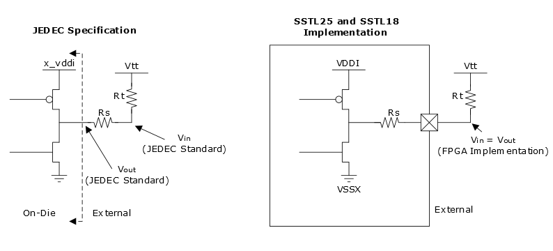

# SSTL25 and SSTL18 Stub Resistor

For stub-series interface standard SSTL, the output drive also includes  the stub resistor. I/Os support this stub resistor for SSTL25 and SSTL18 I/O standards  \([Figure   1](#GUID-4287D020-F219-41E1-8B61-7B0655F42D60)\). This feature reduces both cost and board complexity.

**Parent topic:**[I/O Analog \(IOA\) Buffer Programmable Features](GUID-CC29CF66-77AD-471C-8A06-94A7337826B5.md)

