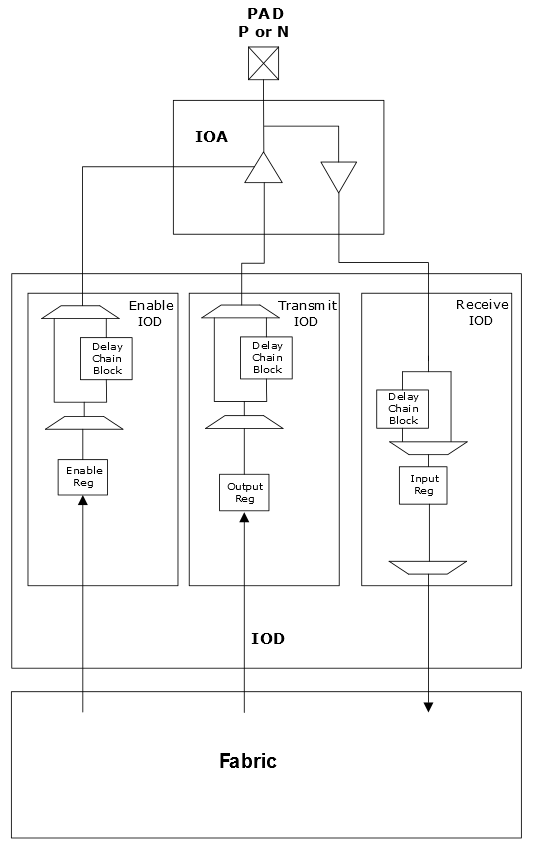

# I/O Registers

The IOD block includes registers for data-in, data-out, and output enable signals. The input registers \(IOINFF\) provide the registered version of the input signals from the IOA to the FPGA fabric. The output registers \(IOUTFF\) provide the registered version of the output signals from the FPGA fabric to the IOA. The output enable register \(IOENFF\) acts as a control signal for the output if the I/O is configured as tri-stated or bidirectional. The following figure shows the I/O registers. These registers in IOD blocks are similar to the D-type flip-flops available in fabric logic elements. The IOD blocks contain several macros that cannot be instantiated. The macros are included in the place and route software.

The I/O register is used for:

-   Better I/O interface performance, as the registers are placed close to the I/O pads.
-   Synchronizing the transmit and receive bus signals. For example, the I/O registers ensure that all the bits of the bus are synchronized to the clock signal when they are transmitted or received.

The I/O registers are used by default during place and route if the register can be mapped to the I/O register.

The PF\_IO macro must be used to configure I/O registers. The configurator constructs  registered I/O blocks that can be instantiated. See [Basic I/O Configurator - PF\_IO](GUID-02EDF24D-96CA-492C-8F89-2B1C3F54328D.md#GUID-D62E4739-24F8-4433-8B8B-1F3BF45571A8).

-   **[Input Register](GUID-B67CEDE3-19CA-49FF-9F40-D56FB6398627.md)**  

-   **[Output Register](GUID-D0FB7A0B-AB16-4F66-8705-9D5CC6BD0C1B.md)**  

-   **[Enable Register](GUID-845761C8-E47E-4FDC-8052-E809B4756DFD.md)**  

-   **[I/O Register Combining](GUID-EA304B8A-9051-4238-B564-BC65AE85378B.md)**  

**Parent topic:**[IOD Block Overview](GUID-955B8943-849D-4CC8-8052-F4A167A48B29.md)

