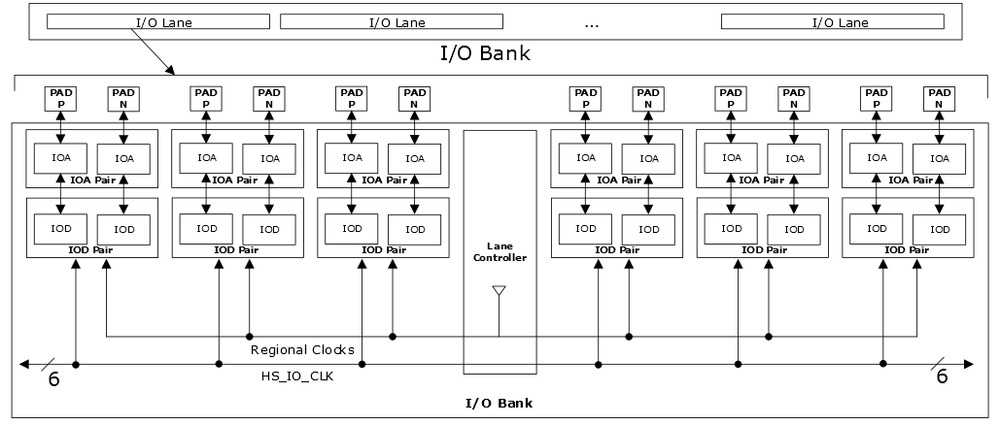

# I/O Lanes

To support memory interfaces, I/O pairs are grouped into lanes, with multiple  lanes per bank. Each lane consists of twelve I/Os \(six I/O pairs\), a lane controller,  and a set of high-speed, low-skew clock resources. The uppermost lane on the western  side of devices has less than six I/O pairs in each lane. The high-speed and low-skew  clock resources in the I/O lane include a global clock network, regional clock networks,  high-speed clock networks, and lane controller clock networks, see [PolarFire Family Clocking Resources User Guide](https://ww1.microchip.com/downloads/aemDocuments/documents/FPGA/ProductDocuments/UserGuides/Microchip_PolarFire_FPGA_and_PolarFire_SoC_FPGA_Clocking_Resources_User_Guide_VB.pdf) for more information.

The I/O lane is used for easy implementation of integrated PHY for memory. For example, a 32-bit SDRAM interface requires four I/O data lanes. Each data lane uses one I/O lane—two I/O pads are used for DQS, eight I/O pads are used for DQ bits, one pad is used for data mask \(DM\), and one I/O pad is used as a spare. The lane topology is also used to construct generic I/O interfaces, which requires high-speed and low-skew clocking.

The following illustration shows the I/O lanes diagram.

-   **Global Clock Network**—is used to distribute high fan-out signals such as clocks and resets across the FPGA fabric with low-skew.

-   **Regional Clock Networks**—are low-latency networks that distribute clocks only to a specific designated area based on the driving source. Regional clock networks are used to move data in and out of the fabric.

-   **High-Speed I/O Clock Networks**—are used to distribute high-speed clocks along the edge of the device to service the I/Os. High-speed I/O clock networks are used to implement high-speed interfaces.

Regional and Global I/O clock performance varies around the periphery of the device. The Regional Clock maximum frequency is slower than the Global I/O clock. This is inherent to device design as the regional clock is meant to be utilized in close proximity to its source.

-   **[Lane Controller](GUID-1E8CFAFF-81DA-436F-A567-8202CC95424F.md)**  

-   **[I/O Lanes in Each Bank](GUID-2227C38D-7FCE-4A20-9B53-28D953767052.md)**  

**Parent topic:**[IOD Features and User Modes](GUID-07762CFD-2C12-4CB2-A30A-22A7794DF08F.md)

