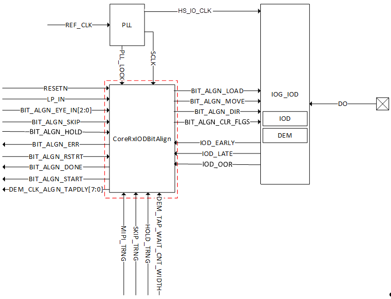
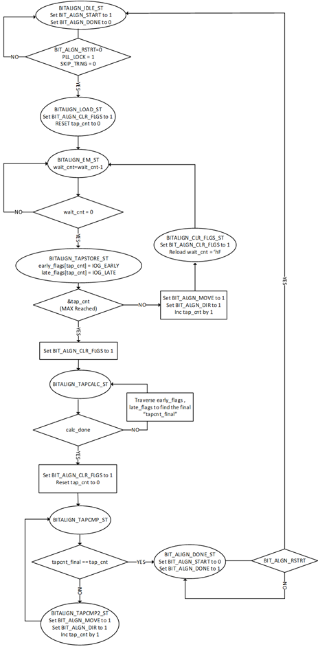
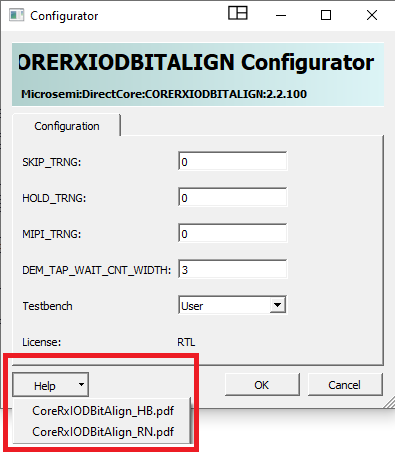

# CoreRxIODBitAlign

CoreRxIODBitAlign IP available from the Libero SoC Catalog performs training when interfacing the IOD macro to support as a dynamic source with adjusting delays to capture the data correctly.

**Important:** HS\_IO\_CLK is internal connection.

This CoreRxIODBitAlign IP works based on Fabric clock \(OUT\_FABCLK\*\) from CCC or PLL component and PF\_IOD\_GENERIC\_RX IOD component works based on OUT\*\_HS\_IO\_CLK\_\* or for bit alignment.

An example application for bit alignment uses the PF\_IOD\_GENERIC\_RX IOD  component to receive the serial data with a required data rate of 1000 Mbps in DDRx4 fabric  mode. The OUT2\_FABCLK\_0 know as SCLK is driven from the PLL of the CCC component at 125 MHz  and OUT0\_HS\_IO\_CLK\_0 to PF\_IOD\_GENERIC\_RX at 500 MHz.

The CoreRxIODBitAlign IP starts the training when the PLL\_LOCK is stable and  driven high. The LP\_IN input is used only in the CoreRxIODBitAlign IP when MIPI\_TRNG parameter  is set to 1. This LP\_IN signaling is active low and level-based, detected as negative edge  every time by the IP to indicate the valid start of frame to start the bit alignment training  mechanism. If MIPI\_TRNG parameter is set to 0, then this input is left unused by the IP.

The CoreRxIODBitAlign IP indicates the start of training by driving BIT\_ALGN\_START high and BIT\_ALGN\_DONE as low. It then drives the output BIT\_ALGN\_LOAD to load the default settings in the PF\_IOD\_GENERIC\_RX component. The BIT\_ALGN\_CLR\_FLGS is used to clear the IOD\_EARLY, IOD\_LATE and BIT\_ALGN\_OOR flags.

The CoreRxIODBitAlign IP proceeds with BIT\_ALGN\_MOVE followed with  BIT\_ALGN\_CLR\_FLGS for every TAP and records the IOD\_EARLY,  IOD\_LATE flags. When BIT\_ALGN\_OOR is set high by the  PF\_IOD\_GENERIC\_RX component, then the CoreRxIODBitAlign IP  sweeps the recorded EARLY and LATE flags and finds the optimal  EARLY and LATE flags to calculate the required TAP delays for  clock and data bit alignment. CoreRxIODBitalign IP selects the  window size, which has the best case IOD\_EARLY and IOD\_LATE  flags counts.

The CoreRxIODBitAlign IP loads the calculated TAP delays and drives BIT\_ALGN\_START low and BIT\_ALGN\_DONE high to indicate the completion of the training.

The CoreRxIODBitAlign IP continues the Re-training dynamically if it detects noisy IOD\_EARLY or IOD\_LATE feedback assertion from PF\_IOD\_GENERIC\_RX component. The BIT\_ALGN\_DONE is reset and driven low and BIT\_ALGN\_START is driven high again by the CoreRxIODBitAlign IP to indicate the restart of the training. The timeout counter when reaches the timeout condition asserts the BIT\_ALGN\_ERR at the end of the training.

The CoreRxIODBitAlign IP also provides restart mechanism for the user to restart  the training whenever required. The BIT\_ALGN\_RSTRT  input is active high level must be driven high  \(for example, 8 clocks\). The BIT\_ALGN\_DONE is  reset and driven low. BIT\_ALGN\_START is driven  high again by the CoreRxIODBitAlign IP to indicate  the fresh start of the training.

The CoreRxIODBitAlign IP also provides hold mechanism to hold the training in  the middle. In this use case, the HOLD\_TRNG  parameter must be set to 1 then the  CoreRxIODBitAlign IP uses the BIT\_ALGN\_HOLD input  and asserts active high level-based until it  requires the CoreRxIODBitAlign IP to hold the  training and then continues the training when the  input BIT\_ALGN\_HOLD is driven low.

For more information about IP module usage, see HB0861: CoreRxIODBitAlign Handbook. This handbook can be downloaded from the Libero SoC Catalog.

The following figure shows the CoreRxIODBitAlign Libero SoC Configurator.

IOD analysis is available for generic RX IOD interfaces that use the CoreRXIODBITALIGN IP.  SmartDebug includes an utility that can analyze the clock  and data margins of an interface. The utility provides  feedback on the amount of delay taps between lanes to  depict any disparity in PCB routing deviations. See [SmartDebug User Guide](http://coredocs.s3.amazonaws.com/Libero/2025_1/Tool/smartdebug_ug.pdf) for more information.

**Parent topic:**[Dynamic IOD Interface Training](GUID-78782CBA-B102-43F0-809A-790406FCEFC8.md)

