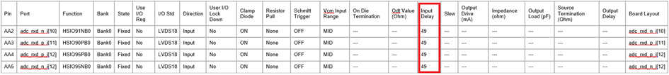

# Static Timing Analysis

Static delays are automatically prescribed by the IOD configurator. The values  that are added based on the IOD configuration can be found in the  `boardlayout.xml` report shown in the following figure. These are the  initial values set by the software based on initial IOD setup information. The settings  can be modified as mentioned in the preceding section with pdc or IOEditor. You can  adjust the delay values by adding or subtracting from the initial value applied in the  Libero SoC configurations. The per tap incremental delay value is found in the  respective [PolarFire FPGA Datasheet](https://ww1.microchip.com/downloads/aemDocuments/documents/FPGA/ProductDocuments/DataSheets/PolarFire-FPGA-Datasheet-DS00003831.pdf) or [PolarFire SoC Datasheet](https://ww1.microchip.com/downloads/aemDocuments/documents/FPGA/ProductDocuments/DataSheets/PolarFire-SoC-Datasheet-DS00004248.pdf).

**Parent topic:**[Programmable I/O Delay](GUID-90C2D28A-F084-436E-9F82-00C82B27D19C.md)

