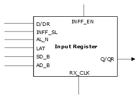

# Input Register

The following illustration shows the input register.

The following table lists the input register pins and descriptions.

|Ports|Types|Descriptions|
|-----|-----|------------|
|RX\_CLK|Input|Receive Clock input|
|D/DR|Input|Data input|
|Q/QR|Output|Data output|
|INFF\_EN|Input|Clock enable \(active high\)|
|INFF\_SL|Input|Synchronous load \(active high\)|
|AL\_N|Input|Active low asynchronous load \(active low\)|
|LAT|Input|Latch enable \(active high\)|
|SD\_B|Input|Synchronous data|
|AD\_B|Input|Asynchronous data \(active low\)|

**Parent topic:**[I/O Registers](GUID-AF2C0EDA-82DC-4FFC-90AF-1D529037F3DC.md)

