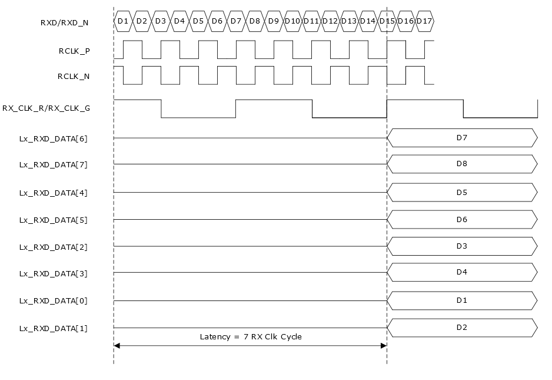
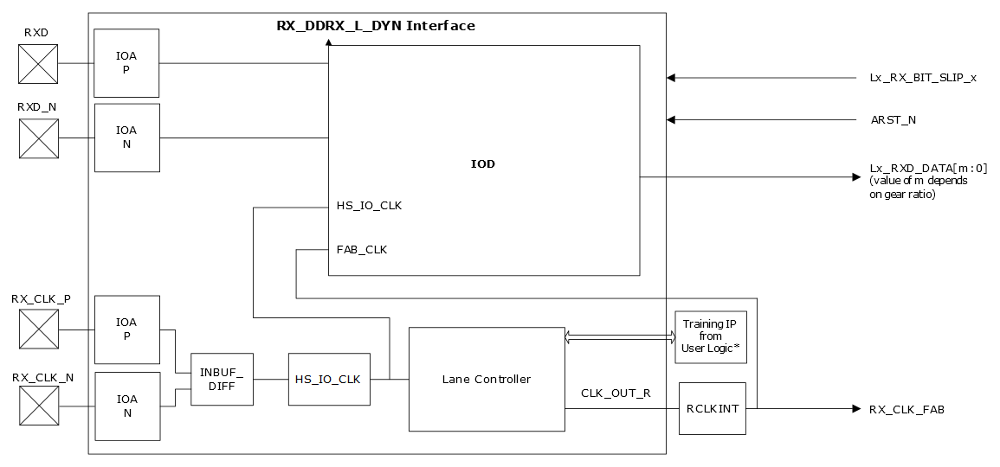

# RX\_DDRX\_B\_G\_DYN/ RX\_DDRX\_B\_R\_DYN

The RX\_DDRX\_B\_G\_DYN/ RX\_DDRX\_B\_R\_DYN interface is used to capture DDR data using  dynamic control. The clock and data relationship can be adjusted dynamically when the  device receives the DDR data. The RX\_DDRX\_B\_G\_DYN/ RX\_DDRX\_B\_R\_DYN interface uses the  digital ratio of 2, 3.5, 4, and 5. These interfaces can use single-ended,  voltage-referenced, or differential I/O standards.

The interface receives the data RXD and the clock RX\_CLK through I/O and passed  the data Lx\_RXD\_DATA and fabric clock \(RX\_CLK\_FAB\) to the fabric. The receive clock  input \(RX\_CLK\) is passed through the lane controller to generate RX\_CLK\_FAB, which is  driven by RCLKINT.

The following illustration shows the signal waveform of RX\_DDRX\_B\_G\_DYN/ RX\_DDRX\_B\_R\_DYN interface when slip input is not used.

The following illustration shows the block diagram of RX\_DDRX\_B\_G\_DYN/ RX\_DDRX\_B\_R\_DYN interface.

**Note:** For information about connections between IOD block and user training IP, see [Dynamic Delay Control](GUID-57F1B703-45B4-4461-92AB-0152A550919C.md).

-   **[Interface Ports](GUID-A70ECAA5-703F-4C74-A9AB-394D7C6F008F.md)**  

-   **[Interface Selection Rules](GUID-C00F7871-31CC-481D-AE5A-BC9955EF28D2.md)**  

**Parent topic:**[Generic I/O Interfaces](GUID-A63099D1-2595-43B7-B69C-1ABB1F7E412A.md)

