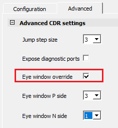
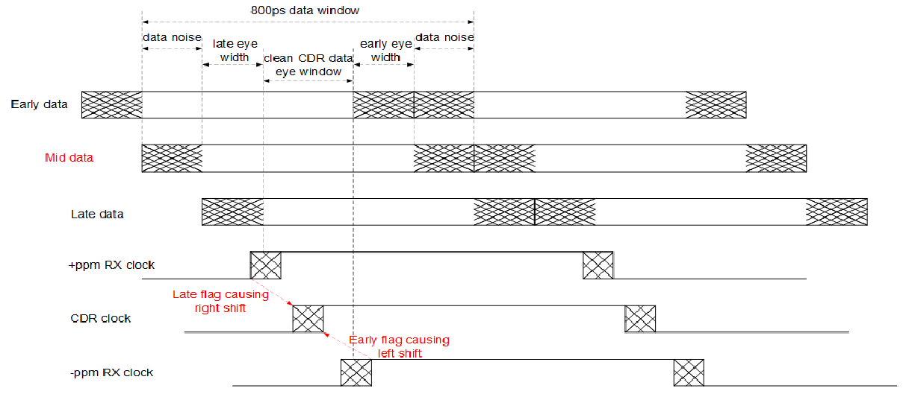

# Transmit Interface

The PF\_IOD\_CDR transmit interface converts the parallel data into a  serial data stream using the IOD interface. It receives the parallel data TXD\[9:0\] and  transmits it through the I/O ports such as TX\_P and TX\_N. The PF\_IOD\_CDR transmit  interface uses the same PLL used in the receive interface. The transmit clock generated  is connected to the pin TX\_CLK\_G of the PF\_IOD\_CDR. The source clock is connected to  HS\_IO\_CLK\_0.

The following table shows the PF\_IOD\_CDR interface associated ports.

|Port|I/O|BIF|Description|
|----|---|---|-----------|
|HS\_IO\_CLK\_0[1](#ID-000036F3)|Input|CDR\_
CLOCKS|Bank clock with phase 0 is used for  both receive and transmit interface. Frequency must be half the rate of  the serial data input.|
|HS\_IO\_CLK\_901|Input|CDR\_
CLOCKS|Bank clock with phase 90 is used for  the I/O clock recovery. Frequency must be half the rate of the serial  data input.|
|HS\_IO\_CLK\_1801|Input|CDR\_
CLOCKS|Bank clock with phase 180 is used for  the I/O clock recovery. Frequency must be half the rate of the serial  data input.|
|HS\_IO\_CLK\_2701|Input|CDR\_
CLOCKS|Bank clock with phase 270 is used for  the I/O clock recovery. Frequency must be half the rate of the serial  data input.|
|PLL\_LOCK|Input|CDR\_
CLOCKS|Lock signal from CCC-PLL.|
|HS\_IO\_CLK\_PAUSE|Input|CDR\_
CLOCKS|Toggling the HS\_IO\_PAUSE:– Resets the IOD RX state machines. This reset  re-synchronizes pattern to HS\_IO\_CLK \(bank clock\) and RXCLK.– Resets any adjustment done through SLIP  operation.– Resets the IOD TX state  machines. This reset synchronizes HS\_IO\_CLK and TXCLK.–  HS\_IO\_PAUSE does not disrupt delay line value settings.|
|DLL\_LOCK|Input|CDR\_
CLOCKS|Lock signal from CCC-DLL.|
|TX\_CLK\_G|Input|CDR\_
CLOCKS|Transmit clock from the Fabric.|
|DLL\_DELAY\_CODE\[6:0\][2](#ID-000036F6)|Input|CDR\_
CLOCKS|Delay code bus input from DLL-CCC. DLL  delay code for 90° phase of the data.|
|DLL\_VALID\_CODE|Input|CDR\_
CLOCKS|Delay code valid input from Master  IO\_CDR Lane.|
|CDR\_START|Input|CDR\_
CLOCKS|Start signal from the Master IO\_CDR  Lane.|
|STREAM\_START[3](#ID-000036F8)|Input|—|High input indicates valid serial input  stream. STREAM\_START signals to the CDR locks to a valid incoming serial  data stream. This signal must not be tied high. It must be controlled to  go high to indicate the incoming data stream is valid. This is extremely  important at start-up or power-up.|
|TX\_DATA\[9:0\]|Input|—|Transmit parallel data.|
|ODT\_EN|Input|—|On Die Termination Enable Input.  Optional pin is used with LVDS Fail Safe operation. See [Dynamic ODT or Fail-Safe LVDS](GUID-A6BFBAB6-5087-4127-A681-DE60DBA33993.md) for  information.|
|RX\_P|Input Pad|—|Serial data input \(P side\).|
|RX\_N|Input Pad|—|Serial data input \(N side\).|
|RX\_BIT\_SLIP[4](#ID-000036FA)|Input|—|This port is used to rotate the  parallel data word from the IOD to match the proper alignment of the  data per lane.|
|RST\_N[5](#00003756)|Input|—|Active asynchronous low reset  input.|
|RX\_CLK\_R|Output|—|Recovered clock for the fabric  interface is divided by five from the HS\_IO\_CLK. This clock is routed  using a regional clock.|
|RX\_VAL|Output|—|The CDR is locked to the incoming  serial data after indication by STREAM\_START that the incoming data is  valid. When the IO\_CDR locks to the data, indicated by RX\_VAL going  high, any disruptions of data stream will not cause RX\_VAL to  change.|
|TX\_P|Output Pad|—|Serial data output \(P side\).|
|TX\_N|Output Pad|—|Serial data output \(N side\).|
|\(1\) PLL  takes any reference clock input frequency \(default 125 MHz\) and outputs  625 MHz clock with 0, 90, 180, and 270 degree shift on four outputs.\(2\) DLL takes 625 MHz  reference clock input from the PLL output in Clock Reference Mode  and outputs delay code as quarter of the clock cycle. The delay code  is used in calculating of fine tune delay of CDR clock phase.\(3\)For more information, see AN4623 REVB \(or later\), which provides  an instance of a valid rx stream detection implemented in the  SSDetect block.\(4\) User optional  pin enabling the BITSLIP exposes the Lx\_BIT\_SLIP.\(5\)Resets the IOD block of  the IOCDR. Does not reset DLL. | |

<table id="ID-000036FE"><thead><tr id="ID-00003706"><th id="ID-00003707">

GUI Option

</th><th id="ID-00003709">

Selections

</th></tr></thead><tbody><tr id="ID-0000370C"><td id="ID-0000370D">

Jump Size Step

</td><td id="ID-0000370F">

Do not change default

</td></tr><tr id="ID-00003711"><td id="ID-00003712">

Expose Diagnostic Ports

</td><td id="ID-00003714">

When checked, ports expose. \(see [Table   3](#ID-0000371E)\)

</td></tr><tr><td>

Eye window override

</td><td>

  This option allows the user to customize the width of the Eye Monitor  at the Receive end \(RX\_P and RX\_N\). Once the option is selected, the  user can customize the value of Eye window P  side and Eye window N side  within the range of 1–7 as shown in the following figure.  

  **Note:** For data rates lower than 1 Gbps, the default eye window sizes of 5 and 6 might not be sufficient for data streams with high jitter. In this case, the **Eye window override** option can be used to increase the width of the Eye Monitor for achieving better performance.

 

</td></tr><tr id="ID-00003718"><td id="ID-00003719">

Flag Window Size

</td><td id="ID-0000371B">

Do not change default

</td></tr></tbody>
</table>|Port|I/O|Description|
|----|---|-----------|
|SELA\_LANE\[10:0\]|Output|SELA/SELB bits \[10:0\]  toggles when the internal CDR clock is switched from delay line A to B  or vice versa. Bits\[9:8\] - Course phase selection for CDR clock \(0,  90, 180, 270\). Bits \[7:0\] - Fine phase selection for the CDR  clock, 25pS delay taps \(0....90\)25pS is typical \(not PVT  calibrated\). See respective device family datasheet for more  information about range.|
|SELB\_LANE\[10:0\]|Output|
|EARLY\_N|Output|EYE\_MONITOR\_EARLY and EYE\_MONITOR\_LATE  flag outputs indicate whether the data edges are closer to the clock  edges than this minimum setting.|
|LATE\_N|Output|
|CDR\_READY|Output|Output asserts when CDR is locked and  stays high until reset.|
|SWITCH\_LANE|Output|Ports toggle when there is a clock  phase shift. Accompanying with EARLY/LATE flags; this indicates if the  phase shift is increasing or decreasing the delay line when SWITCH\_LANE  output asserts. If both flags are high with SWITCH\_LANE high, there is  clock jitter and/or causing data errors.|
|CLR\_FLAGS\_N|Input|Port is used to clear the flags and restarts the  early/late monitor after each time the status is recorded.|

**Important:** 25 pS is typical and not PVT calibrated. For range information, see respective [PolarFire FPGA Datasheet](https://ww1.microchip.com/downloads/aemDocuments/documents/FPGA/ProductDocuments/DataSheets/PolarFire-FPGA-Datasheet-DS00003831.pdf) or [PolarFire SoC FPGA Datasheet](https://ww1.microchip.com/downloads/aemDocuments/documents/FPGA/ProductDocuments/DataSheets/PolarFire-SoC-Datasheet-DS00004248.pdf).

The following figure shows the IOCDR Flags.

The advanced diagnostic ports are intended for monitoring IOD operation and for interface  debugging. Users can monitor these flags with counters for analyzing the operation of  the IOD training.

**Parent topic:**[PF\_IOD\_CDR](GUID-8EA0853D-A9F3-4136-B6CC-7B515BF36957.md)

