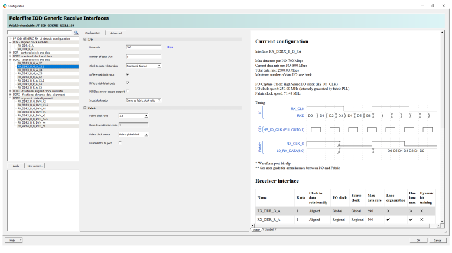

# 7:1 LVDS Receive Interface

The LVDS 7:1 receive module receives LVDS data and an LVDS clock from the FPGAs LVDS IOA inputs. The source-synchronous LVDS clock is passed to the fabric clock conditioning circuitry \(CCC\) block while the LVDS data is sent to the RX\_DDRX\_B\_G\_FA \(fractional aligned clock and data\) using 3.5 gearing ratio. The receive block uses double data rate registers to capture data on both the rising and falling edge of the input clock. RX\_BIT\_SLIP is not available in DDRX3P5 gearing, which requires the bit and word alignment to be part of the FPGA fabric IP. The data is deserialized to 7-bit data that is sent to the fabric with a forwarded clock.

**Parent topic:**[LVDS 7:1](GUID-F8878616-7DDC-4EC3-A0F4-A77EEC61E198.md)

