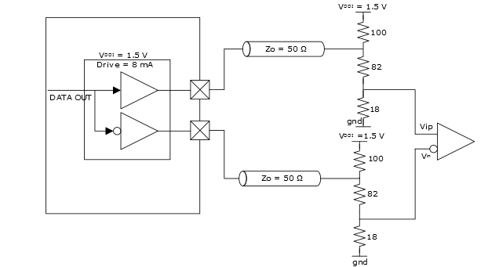

# Scalable Low-Voltage Signaling Emulated \(SLVSE15\) Output Mode

GPIO and HSIO support SLVS transmitter with external terminations. The  following illustration shows an example of SLVSE implementation. This implementation  requires 100Ω, 82Ω, and 18Ω external termination. Additionally, all driver output levels in  the implementation are level-shifted by approximately 18%.

**Parent topic:**[Implementing Emulated Standards for Outputs](GUID-CEDCE521-84AB-4ACB-9B30-7E70F1D7BAB1.md)

