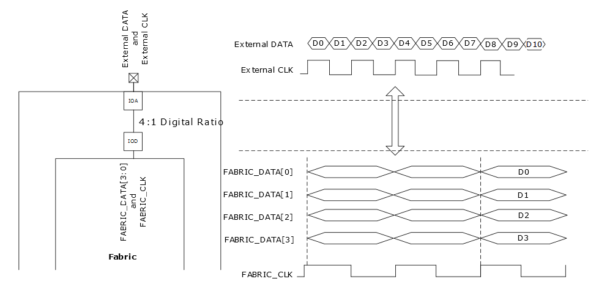

# I/O Gearing

I/O gearing handles serial-to-parallel and parallel-to-serial conversion of multiple FPGA fabric signals to and from a single device I/O based on user clock settings, as shown in the following illustration. The gearbox either deserializes and transfers input data to a lower core clock speed, or transfers lower-speed data from the fabric to the high-speed output clock domain, and serializes it in the process. Libero SoC automatically configures these gearboxes based on the application settings. Generic IOD interfaces provide a complete solution from the I/O pins to the fabric. Generic IOD is supported by construction using Libero SoC configurators and limited to the defined list of use cases. See [Generic I/O Interfaces](GUID-A63099D1-2595-43B7-B69C-1ABB1F7E412A.md) for available support.

The following illustration shows the I/O gearing example, where high-speed  serial data is passed from I/O to fabric through four signals at lower speed.

**Parent topic:**[IOD Block Overview](GUID-955B8943-849D-4CC8-8052-F4A167A48B29.md)

