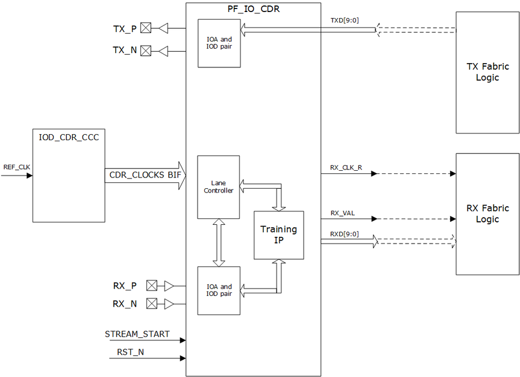

# HS\_IO\_CLK Generation Using PF\_IOD\_CDR\_CCC

The PF\_IOD\_CDR receive interface is sourced by a single PLL driving four bank clocks of 0, 90, 180, and 270 degrees running at the data rate. PF\_IOD\_CDR\_CCC is available in the Libero SoC IP catalog. The PF\_IOD\_CDR transmit interface uses fabric clock on OUT0 port of the PLL and generates the transmit clock.

The following illustration shows the PF\_IOD\_CDR interface connected to the IOD\_CDR\_CCC and fabric logic.

**Parent topic:**[IOD CDR Clocking](GUID-796E3761-49BB-436B-AB3E-85E778C3E8D0.md)

