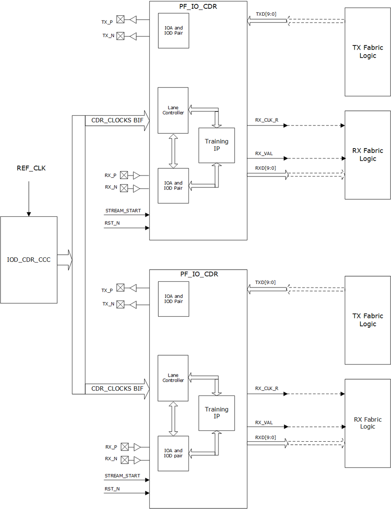

# Clock Sharing

The same PLL is shared between the PF\_IOD\_CDR receive and transmit  interfaces, as shown in [Figure   1](#GUID-6E8A1F77-D7F5-462E-A10A-22E790E77006). In addition, multiple PF\_IOD\_CDR interfaces can share the same PLL on  the adjacent vertical and horizontal edges. For instance, the PLL\_SW\_0 interface can drive  the PF\_IOD\_CDR interface on the southern and western edges \(see [PolarFire Family I/O Banks](GUID-015DB00F-F8A2-4F67-8937-A0AC6FACC841.md)\).

The following illustration shows multiple PF\_IOD\_CDR transmit and receive interfaces.

-   **[Interface Selection Rules](GUID-7A5299C8-CEFD-40DC-BE0B-A92A72C04242.md)**  

-   **[Full Duplex 1GbE and SGMII IOCDR](GUID-05A35363-9255-45FE-B112-67BF5D886441.md)**  

**Parent topic:**[PF\_IOD\_CDR](GUID-8EA0853D-A9F3-4136-B6CC-7B515BF36957.md)

