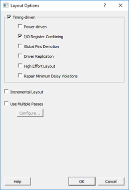

# I/O Register Combining

I/O register combining is supported on enable, input, and output of any I/O. This support is available using the set\_i off command, which is included in a Compile Netlist Constraint \(\*.ndc\) file and passed to the Libero SoC Compile engine for netlist optimization after synthesis.

Syntax:


```
set_ioff -port_name {portname} \
-IN_REG true/1|false/0 \

-OUT_REG true/1|false/0 \

-EN_REG true/1|false/0
```

Arguments

-   &lt;portname&gt;: specifies the name of the I/O port to be combined with a register. The port can be an input, output, or in-out port.

-   IN\_REG: specifies whether the input register is combined into the port &lt;portname&gt;.

-   OUT\_REG: specifies whether the output register is combined into the port

-   EN\_REG: specifies whether the enable register is combined into the port &lt;portname&gt;.


I/O register combining is only permitted with one FF with an I/O. The FF needs to be connected to the I/O with a fanout of one. A bidirectional I/O where both D and Y pins are driven with registered signals can only allow one of the registers to be moved into the I/O pad.

There is another option to allow automatic I/O register combining. This option<br /> is enabled from the **Place and Route**<br /> configuration settings. Right-click **Place and Route** in the project navigator and select the<br /> **I/O Register Combining** checkbox. Enable<br /> this option to combine any register directly<br /> connected to an I/O when it has a timing<br /> Constraint. If there are multiple registers<br /> directly connected to a \(bi-directional\) I/O,<br /> select one register to combine in the following<br /> order: input-data, output-data, output-enable.<br /> Users can use the NDC constraint for more tightly<br /> controlling the use of I/O register combining.

**Important:** This feature is OFF by default. Users must turn it ON to enable combining.

Every I/O has several embedded registers that you can use for faster clock-to-out timing, and external hold and setup. When combining these registers at the I/O buffer, some design rules must be met.

This feature is supported by all I/O standards.

Following are the rules to combining the I/O registers:

-   You can combine only one register with an I/O IN, OUT, or EN.
-   An input register cannot be combined to different I/Os.
-   For input registers \(INFF\), the Y pin of an I/O needs to drive the D pin of a register with fanout of 1.
-   For output registers \(OUTFF\), the Q pin of a register needs to drive the D pin of an I/O with fanout of 1.
-   For enable registers \(ENFF\), the Q pin of a register needs to drive the E pin of an I/O with fanout of 1.



**Parent topic:**[I/O Registers](GUID-AF2C0EDA-82DC-4FFC-90AF-1D529037F3DC.md)

