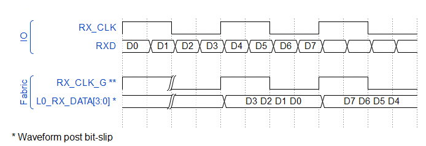

# RX\_DDR Fractional Aligned/Fractional Dynamic Interfaces

The DDR fractional aligned IOD mode is used when the receive clock is a fraction of the data rate. A CCC PLL is inserted by Libero SoC into the clock path with a multiplier of 1, 2, 4, 8, or 10 to match data bit rate. For example, source synchronous clock input RX\_CLK \(which is data-rate / 4\) is provided as a reference clock to a fabric PLL, and generates the HS\_IO\_CLK which is 2X the RX\_CLK. With statically trained interface, the static delays to ensure the HS\_IO\_CLK clock edge alignment within the RXD data bit window. This pre-instantiated PLL also generates the fabric clock \(equal to the RX\_CLK or data-rate / 4\), which is used by the user logic in the fabric to clock the RX\_DATA bits coming out of the IOD macro into the fabric.

Both RX\_DDRX\_FA and RX\_DDRX\_FDYN include PLLs as required to receive a clock that is  slower than the data rate. RX\_DDRX\_FA IOD macro use Libero predefined static settings to  adjust the clock and data alignment. RX\_DDRX\_FDYN IOD macro is similar but it also  includes the control and status ports required for the alignment which is controlled by  the training IP. Both operate similarly except for the training aspect of the  RX\_DDRX\_FDYN. The following figure shows functional waveforms for RX\_DDRX\_FA and  RX\_DDRX\_FDYN.

The following figures shows the waveform diagram of fractional aligned data and clock.

-   **[Interface Ports](GUID-ABA58469-95BC-4910-BFA1-6AAD07FCA5D5.md)**  

-   **[Interface Selection Rules](GUID-94948BC9-821B-4652-9A10-DDA981A635E6.md)**  

**Parent topic:**[Generic I/O Interfaces](GUID-A63099D1-2595-43B7-B69C-1ABB1F7E412A.md)

