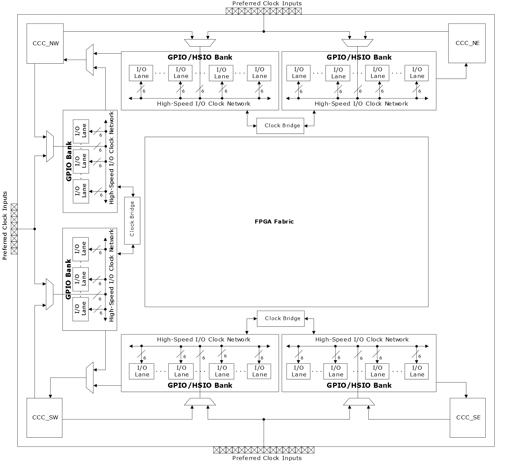

# High-Speed I/O Bank Clock Resource \(HS\_IO\_CLK\)

High-speed I/O bank clock networks are integrated into I/O banks and distribute clocks along the entire I/O bank with low-skew. They are used to clock data in and out of the I/O logic when implementing the high-speed interfaces. The high-speed I/O clock networks are located on the east corner of the FPGA fabric. Each I/O bank can have six high-speed I/O clocks. High-speed I/O clocks from adjacent banks on the same edge can be bridged to build large I/O interfaces. HS\_IO\_CLK bridging is allowed only for fractional IOD Rx interfaces \(See [RX\_DDR Fractional Aligned/Fractional Dynamic Interfaces](GUID-EA8EA594-6224-417D-BF62-A1120CC5854F.md)\).

High-speed I/O clock networks are driven either from I/Os or CCCs. The high-speed clocks can be configured to feed reference clock inputs of adjacent CCCs. HS\_IO\_CLKs are transparent as they are setup by Libero SoC based on configuration.

**Parent topic:**[I/O Clock Networks](GUID-977E0649-932F-443C-867E-A85343F2F11B.md)

