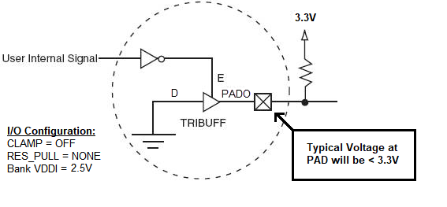

# Open Drain GPIO

GPIO can be used to create an open-drain output when VDDI is below the required  high output level. In this case, the GPIO pin only drives a LOW output. When not driving  LOW, it is externally pulled up to a maximum of 3.3V through an external 200Ω pull-up  resistor. This is accomplished by selecting the CLAMP = OFF and the internal RES\_PULL =  NONE. The actual voltage at the PAD output will be lower than 3.3V, depending on the  value of the pull-up resistor. The user must drive the enable pin of the tristate buffer  through an inverter to reflect the user logic High at the PAD Output.

**Important:** External pull-up values of 250Ω are suggested up to 33 MHz operations. 200Ω pull-up is suggested for up to 50 MHz. The external pull-up resistor acts as a voltage divider between 3.3V and the bank VDDI. Based on the pull-up resistor value and bank VDDI chosen, the PAD output voltage will accordingly be lower than 3.3V.

**Parent topic:**[I/O Analog \(IOA\) Buffer Programmable Features](GUID-CC29CF66-77AD-471C-8A06-94A7337826B5.md)

