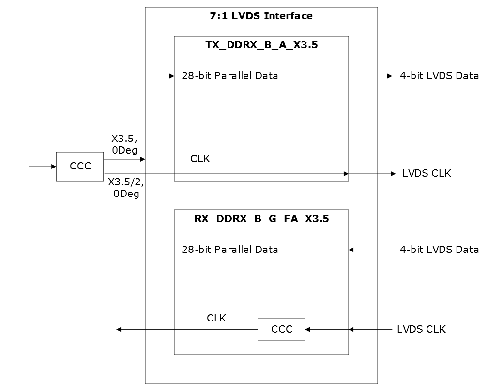

# LVDS 7:1

A typical source-synchronous interface application is the 7:1 LVDS video interface \(used in Channel Link, Flat Link, and Camera Link\). This has become a common standard in many products including consumer devices, industrial control, medical, and automotive telematics. The display interface is a source synchronous LVDS interface. Seven data bits are serialized for each cycle of the low-speed clock. Typically, the interface consists of four \(three data, one clock\) or five \(four data, one clock\) LVDS pairs. The four pairs translate to 21 parallel data bits and five pairs translate to 28 parallel data bits.

-   **[7:1 LVDS Receive Interface](GUID-C94B43F6-31B6-489B-8E87-0BF03B361ECA.md)**  

-   **[7:1 LVDS Transmit Interface](GUID-45CE04F8-4AA8-4CB0-B16B-63C2B0878AEB.md)**  

**Parent topic:**[Protocol-Specific I/O Interfaces](GUID-427F7D4F-0FEB-46AB-BA45-CFBED0CDC201.md)

