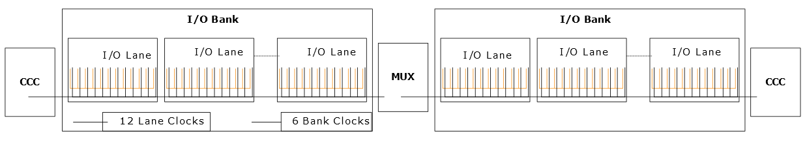

# Lane Clock Resources

Each lane has several clock networks in the I/O lane. The lane clock resources are distributed from each lane controller to each of the 12 IODs within a lane. The lane clock resource is not controllable as Libero SoC automatically uses the lane clock resource based on the I/O configuration.

**Parent topic:**[I/O Clock Networks](GUID-977E0649-932F-443C-867E-A85343F2F11B.md)

