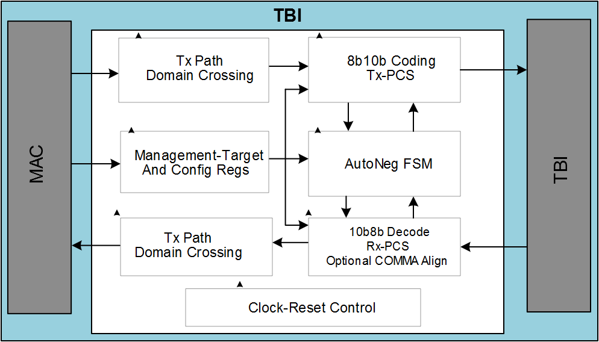

# SGMII/Ten-Bit Interface

This module takes the transmit G/MII data stream, encodes it into 10-bit symbols  and presents 10-bit interface data to Transceiver. Packet data replication is used to  match data rates for the different modes of the MII to the transmit clock. In the  receive direction de-serialized 10-bit symbols are decoded and converted into the  receive G/MII signal set. Packet data under sampling is used to match data rates for the  different modes of the MII to the TBI receive clock.

The design uses transmit, receive, and synchronization state machines as specified in Clause 36 of IEEE 802.3z. Also included auto-negotiation \(AN\) for 1000BASE-X, which is used to exchange information between the link partners. This module is managed and monitored through the MDIO management interface. The extended set of management registers is provided.

Both the transmit and receive paths leverage the physical coding sub layer and the Auto-negotiation sub-layers of the IEEE 802.3z specification, as contained in Clauses 36 and 37. For complete clock domain isolation of the TBI from the MAC, both transmit and receive elasticity FIFOs are used.

The control information exchanged differs from the IEEE specification. Instead  of using the ability advertisement, the PHY sends the control information through its  Tx\_config\_Reg \[15:0\], as listed in following table. Upon receiving control information, the  MAC acknowledges the update of the control information by asserting bit 14 of its  Tx\_config\_Reg \[15:0\].

To maintain a constant clock frequency at the PHY interface for all MAC speeds, the MII bus data must be replicated internally to the TBI. Nibble packet data transmitted by a 100 Mbps MAC must be aligned, concatenated, and replicated 10 times. Nibble packet data transmitted by a 10 Mbps MAC must be aligned, concatenated, and replicated 100 times.

<table id="_REF474251994"><thead><tr><th align="center">

Bit

</th><th align="center">

Tx\_config from PHY to MAC

</th><th align="center">

Tx\_config from MAC to PHY

</th></tr></thead><tbody><tr><td>

15

</td><td>

Link:-   1: Link up
-   0: link down

</td><td>

0: Reserved

</td></tr><tr><td>

14

</td><td>

Reserved for AN ACK.

</td><td>

1

</td></tr><tr><td>

13

</td><td>

0: Reserved

</td><td>

0: Reserved

</td></tr><tr><td>

12

</td><td>

Duplex mode:-   1: Full
-   0: Half

</td><td>

0: Reserved

</td></tr><tr><td>

\[11:10\]

</td><td>

Speed:-   00:10 Mbps
-   01:100 Mbps
-   10:1000 Mbps
-   11: Reserved

</td><td>

0: Reserved

</td></tr><tr><td>

\[9:1\]

</td><td>

0: Reserved

</td><td>

0: Reserved

</td></tr><tr><td>

0

</td><td>

1

</td><td>

1

</td></tr></tbody>
</table>Packet data received by the TBI through the PHY must be under sampled by a factor of 10 before being sent to a 100 Mbps MAC. Packet data received by the TBI through the PHY must be under sampled by a factor of 100 before being sent to a 10 Mbps MAC. For half-duplex functionality, carrier sense is inferred from RXDV, and collision is derived from the simultaneous assertion of TXEN and RXDV.

**Parent topic:**[Functional Description](GUID-1DF3649A-D1B6-4032-BF77-E072F8D8F7FC.md)

