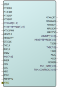

# SmartDesign

CoreTSE is available through the Libero SoC IP catalog. Download it from a remote web-based  repository and install into your local vault to make it ready to use. Once installed in the  Libero software, the core is instantiated, configured, connected, and generated using the  SmartDesign tool.

An example instantiated view is shown in the following figure.

For more information on using SmartDesign to instantiate and generate cores, see [Libero SoC v12.0 and later](https://www.microsemi.com/product-directory/design-resources/1750-libero-soc#downloads) or [Libero SoC v11.9 and earlier](https://www.microsemi.com/product-directory/libero-soc/5507-libero-soc-v11-9-archive#downloads) .

-   **[Configuring CoreTSE in SmartDesign](GUID-36BA0FE0-BF48-405D-97B6-8B08408B9F15.md)**  

-   **[Simulation Flows](GUID-70D48D56-0880-4411-8351-935364F8025A.md)**  

-   **[Synthesis in Libero SoC](GUID-5F98EBB4-BBE1-4285-A81A-99D4900D32C1.md)**  

-   **[Place-and-Route in Libero SoC](GUID-78B9B8F6-6329-4E9E-97B7-6011C650F40A.md)**  

-   **[System Integration](GUID-8877C89D-938A-4564-BD69-87D6C94BC599.md)**  

**Parent topic:**[Implementation of CoreTSE in Libero Design Suite](GUID-74C82F72-9954-45C8-8938-1075A92B0DB1.md)

