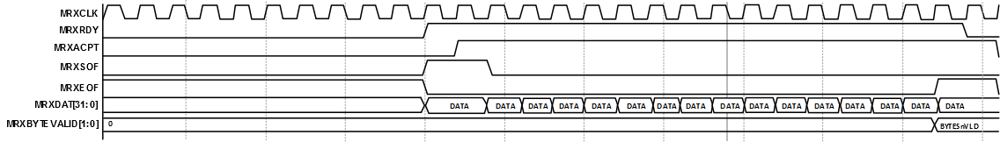

# Receive Operation

The core asserts the MRXRDY along with MRXSOF and MRXDAT \(receive data\) and waits for the MRXACPT. MRXDAT word is available on rising edge of MRXCLK from the MAC receive FIFO until MRXEOF \(end of frame date\). MRXBYTEVALID indicates the byte enables of the MRXDAT last word.

**Parent topic:**[Functional Overview](GUID-64ADE1DA-9F8F-4AE4-8662-BFB56B9E9D2A.md)

