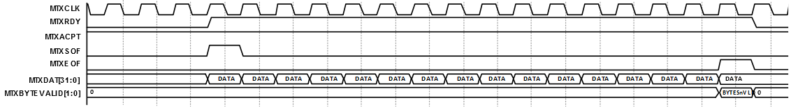

# Transmit Operation

The MTXDAT \(transmit data\) word is recorded into MAC transmit FIFO on rising  edge of MTXCLK upon the assertion of MTXRDY and MTXACPT and the MTXSOF should be  asserted for the first word transfer of the frame. Transmit data stored into MAC  transmit FIFO until MTXEOF \(end of frame date\). MTXBYTEVALID indicates the byte enables  of the MTXDAT last word. MTXACPT is asserted when CoreTSE is capable of receiving at  least one word from the MAC data path transmit interface. MTXACPT should  be monitored for every transmission.

**Parent topic:**[Functional Overview](GUID-64ADE1DA-9F8F-4AE4-8662-BFB56B9E9D2A.md)

