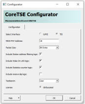

# Configuring CoreTSE in SmartDesign

The core is configured using the configuration GUI within SmartDesign. The example of the GUI is  as shown in following figure.

**Parent topic:**[SmartDesign](GUID-1EE29317-4286-4EF7-8558-17904F8EF9B7.md)

