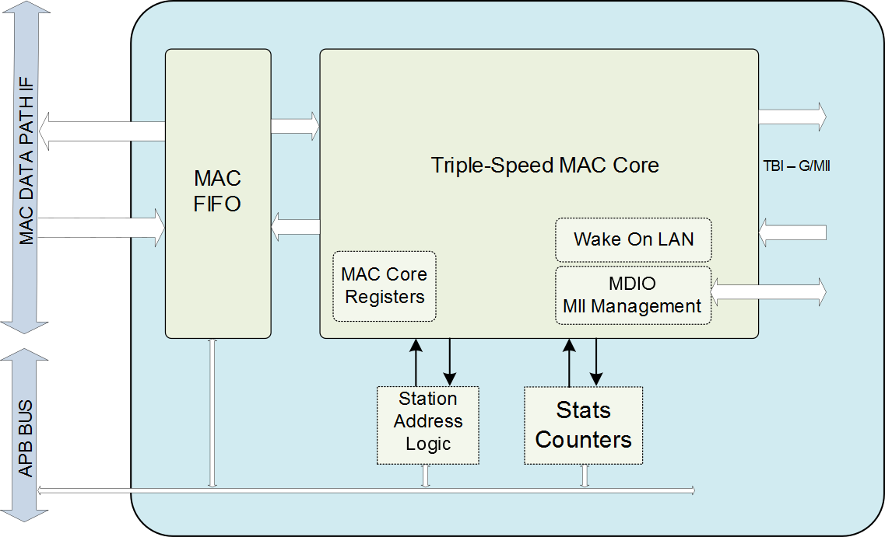

# Introduction

The CoreTSE provides 10/100/1000 Mbps Ethernet Media Access Controller \(MAC\) with a Gigabit  Media Independent Interface \(G/MII\) or Serial Gigabit Media Independent Interface \(SGMII\) Ten  Bit Interface \(TBI\) to support 1000BASE-T and 1000BASE-X.

The CoreTSE has the following major interfaces:

-   G/MII or SGMII TBI physical layer \(PHY\) interface connects to Ethernet PHY
-   Management Data Input or Output \(MDIO\) interface to communicate with the MDIO Manageable Device \(MMD\) in the PHY
-   MAC data path interface
-   Advanced Peripheral Bus \(APB\) - Target interface for MAC configuration registers and status counters access

A triple speed MAC core is responsible for the main functionalities of CoreTSE which are  listed as follows:

-   Statistics gathering - Statistics information is gathered from the data transmitted and received over the Ethernet link.
-   Station address functions - Station address \(SAL\) feature provides address filtering capability.

The following figure shows the block diagram of CoreTSE.

## Summary

<table id="TABLE_BXX_RMR_NRB" class="headercolumn nozebra"><tbody><tr><td>

Core Version

</td><td>

This document applies to CoreTSE version 3.2

</td></tr><tr><td>

Supported Device Families

</td><td>

  -   PolarFire® SoC
-   PolarFire
-   RTG4™
-   IGLOO® 2
-   SmartFusion® 2

 

</td></tr><tr><td>

Supported Tool Flow

</td><td>

Requires Libero® SoC vXXXX.y or later releases

</td></tr><tr><td>

Supported Interfaces

</td><td>

TBD

</td></tr><tr><td>

Includes with IP Core

</td><td>

TBD

</td></tr><tr><td>

Licensing

</td><td>

  CoreTSE is available in the following license versions: Evaluation, Obfuscated  and RTL  -   **Evaluation**: Evaluation version is available for free and supports user testbench simulations and four hours of the functionality on silicon.
-   **Obfuscated**: Obfuscated version is license locked and supports user testbench simulations and unlimited functionality on silicon.
-   **RTL**: Complete encrypted RTL source code is provided for the core.

 

</td></tr><tr><td>

Installation Instructions

</td><td>

CoreTSE must be installed to the **IP Catalog** of Libero SoC automatically  through the IP Catalog update function. Alternatively, CoreTSE could be manually  downloaded from the catalog. Once the IP core is installed, it is configured,  generated, and instantiated SmartDesign within for inclusion in the project.

</td></tr><tr><td>

Device Utilization and Performance

</td><td>

A summary of utilization and performance information for CoreTSE is listed  in[Device Utilization and Performance](GUID-8F09156F-B6ED-4AF9-8403-53214FA2AFBC.md#GUID-AB2B6D52-174B-4A89-96D5-D9F550BE715C).

</td></tr></tbody>
</table>