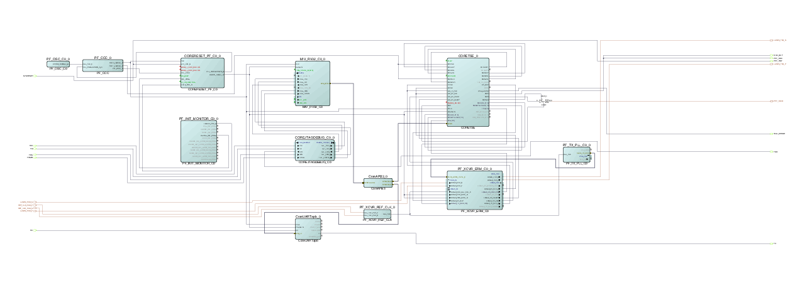

# System Integration

This section provides the details to ease the integration of CoreTSE.

-   FABRIC\_RESET\_N of CORE\_RESET\_PF\_C0 is used as reset for all modules
-   CoreTSE\_0 has PCLK, MTXCLK, MRXCLK, TXCLK, RXCLK, TBI\_TX\_CLK, TBI\_RX\_CLK, and MDC clocks.
-   PCLK is 50 MHz clock generated from PF\_CCC\_0
-   MTXCLK and MRXCLK are 125 MHz clocks generated from PF\_CCC\_0
-   TBI\_TX\_CLK and TXCLK are connected to 125 MHz LANE0\_TX\_CLK\_R of PF\_XCVR\_0
-   TBI\_RX\_CLK and RXCLK are connected to 125 MHz LANE0\_RX\_CLK\_R of PF\_XCVR\_0
-   2.5 MHz MDC is generated by CoreTSE\_0 from PCLK

Run the Libero flow with enabling the timing driven and high effort place and route option. The example design can be obtained from the Microchip technical support team.

**Parent topic:**[SmartDesign](GUID-1EE29317-4286-4EF7-8558-17904F8EF9B7.md)

