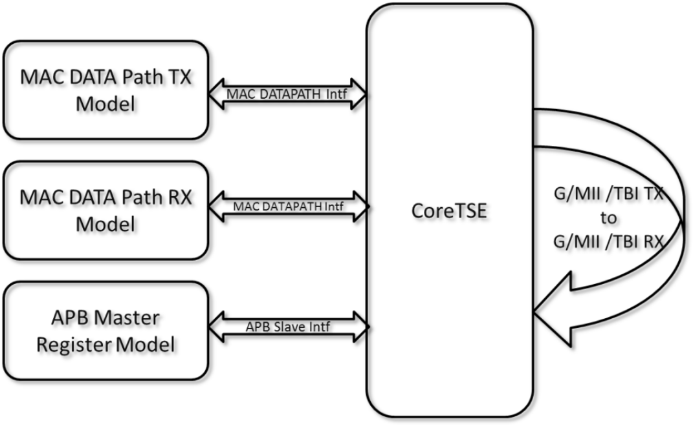

# User Testbench

A simplified block diagram of the user testbench is shown in the following figure. The user testbench instantiates the CoreTSE with near end loopback at TBI/G/MII interface. Testbench provides behavioral, non-synthesizable MAC data path interface models for descriptors and MAC configurations.

Testbench has task based library models for MAC data interface, MAC data transmit, MAC data receive, MAC link transmit, MAC link receive, and generic testbench to check and report errors.

-   **[TBI Mode](GUID-969A1725-80AE-4C5F-88EA-8374687F06F3.md)**  

-   **[G/MII Mode](GUID-83D506B3-387A-465B-BA4A-93B457BF0A17.md)**  

**Parent topic:**[Testbench](GUID-60753284-63AE-46E3-9861-674EFBA7F096.md)

