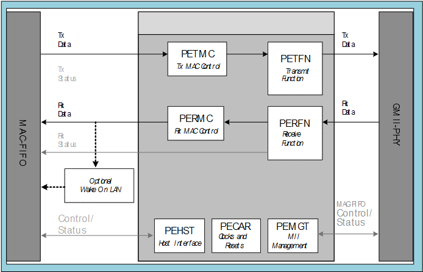

# Triple Speed MAC

This core is a full-featured 10/100/1000 Mbps MAC with standard G/MII. The MAC has built in G/MII to TBI converter, which supports 1000 Mbps with TBI. The core is capable of full-duplex operation at 10, 100, or 1000 Mbps and of half duplex operation at 10 and 100 Mbps.

In half-duplex mode, the MAC adheres to the Carrier Sense Multiple Access/Collision Detect Access method as defined in IEEE 802.3 and its several supplements including IEEE 802.3u. In full-duplex mode, the MAC follows IEEE 802.3x, which ignores both carrier and collisions. Following each packet transmission or abortion, a transmit statistics vector is used for statistics collection.

The external PHY device presents packets to the MAC. The MAC scans the preamble  searching for the Start Frame Delimiter \(SFD\). When the SFD is found, the preamble and  SFD are stripped and the frame is passed to the system. Following each frame reception,  a Receive Statistics Vector \(RSV\) is used for frame filtering and statistics  collection.

CoreTSE supports PAUSE control frames. This core also includes optional support  for Wake-on-LAN \(WoL\) module. The WoL module detects both IEEE 802.3-compliant unicast  frames with a destination address that matches the station address and packets that use  AMD’s Magic Packet™ Detection technology. The detection  functionality can be enabled or disabled.

**Parent topic:**[Functional Description](GUID-1DF3649A-D1B6-4032-BF77-E072F8D8F7FC.md)

