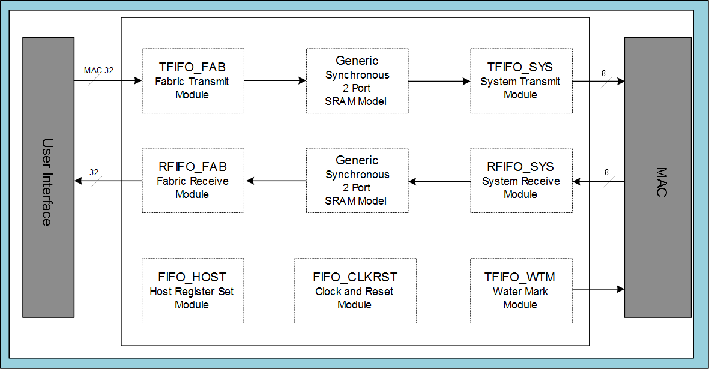

# MAC FIFO

This core provides data queuing for increased throughput and sits between back-end, user-interface logic, and MAC core. The core provides clock-domain crossing, automatic pause frame handshaking, and graceful frame dropping.

The data is buffered between the system-interface and the MAC core by transmit and receive FIFOs. The FIFO size can be configured with PACKET\_SIZE parameter.

Each RAM has additional associated control bits, which are additional to maximum  frame data size.

|PACKET\_SIZE Parameter \(Bytes\)|Transmit RAM|Receive RAM|
|RAM Size in Bits|Number of Address bits \(TABITS\)|RAM Size in Bits|Number of Address bits \(RABITS\)|
|--------------------------------|------------|-----------|
|----------------|---------------------------------|----------------|---------------------------------|
|256|64 x 39|6|128 x 36|7|
|512|128 x 39|7|256 x 36|8|
|1K|256 x 39|8|512 x 36|9|
|2K|512 x 39|9|1K x 36|10|
|4K|1K x 39|10|2K x 36|11|
|8K|  2K x 39 |11|4K x 36|12|
|16K|  4K x 39 |12|8K x 36|13|
|32K|  8K x 39 |13|16K x 36|14|

**Parent topic:**[Functional Description](GUID-1DF3649A-D1B6-4032-BF77-E072F8D8F7FC.md)

