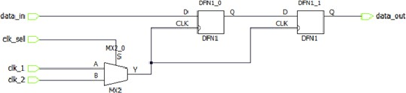
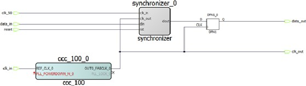

# set\_clock\_groups

## Description

Disables timing analysis between the specified clock groups. No paths are reported between the clock groups in both directions. Paths between clocks in the same group continue to be reported.

**Important:** If you use the same name and the same exclusive flag of a previously defined clock group to create a new clock group, the previous clock group is removed and a new one is created in its place. The exclusive flags for the arguments above are all mutually exclusive. Only one can be specified.

```
set_clock_groups [-name name ] \
[-physically exclusive | -logically exclusive | -asynchronous] \
[-comment comment_string ] \
-group clock_list
```

## Arguments

<table id="GUID-30DAE823-014E-43B8-8F7A-8A7D362892D1"><thead><tr><th>

Parameter

</th><th>

Type

</th><th>

Description

</th></tr></thead><tbody><tr><td>

`name`

</td><td>

string

</td><td>

Name given to the clock group.

</td></tr><tr><td>

`physically_exclusive`

</td><td>

None

</td><td>

Specifies that the clock groups are physically exclusive with respect to each other. Examples are multiple clocks feeding a register clock pin. **Important:** The exclusive flags are all mutually exclusive. Only one can be specified.

</td></tr><tr><td>

`logically_exclusive`

</td><td>

None

</td><td>

Specifies that the clocks groups are logically exclusive with respect to each other. Examples are clocks passing through a MUX.

</td></tr><tr><td>

`asynchronous`

</td><td>

None

</td><td>

Specifies that the clock groups are asynchronous with respect to each other, as there is no phase relationship between them. **Important:** The exclusive flags are all mutually exclusive. Only one can be specified.

</td></tr><tr><td>

`group`

</td><td>

list of strings

</td><td>

Specifies a list of clocks. There can any number of groups specified in the `set_clock_groups` command.

</td></tr></tbody>
</table>|Return Type|Description|
|-----------|-----------|
|`integer`|Returns the ID of the clock group.|

## Error Codes

|Error Code|Description|
|----------|-----------|
|None|Invalid set\_clock\_groups constraint - only one of -physically\_exclusive, -logically\_exclusive, or -asynchronous should be used.|

## Supported Families

<table id="GUID-56F9E300-6CAB-48D0-9D92-B4EC8F62D904"><tbody><tr><td>

PolarFire®

</td></tr><tr><td>

PolarFire SoC

</td></tr><tr><td>

SmartFusion® 2

</td></tr><tr><td>

IGLOO® 2

</td></tr><tr><td>

RTG4™

</td></tr></tbody>
</table>## Example

1.  The following figure shows how to use the `set_clock_groups` constraint for multiplexed clocks..

    

    SDC:

    ```
    create_clock -name clk_1 -period 5 [ get_ports clk_1 ]
    create_clock -name clk_2 -period 10 [ get_ports clk_2 ]
    set_clock_groups -logically_exclusive -group clk_1 -group clk_2
    ```

    This command implies that `clk_1` is asynchronous to `clk_2`.

2.  Here, there are three synchronous clocks receiving data from an asynchronous clock.

    

    SDC:

    ```
    create_clock -name clk_in -period 10 [ get_ports clk_in ]
    create_clock -name clk_50 -period 20 [ get_ports clk_50 ]
    create_generated_clock -name ccc_100 -divide_by 2 \
    -source [ get_pins ccc_100_0/ccc_100_0/pll_inst_0/REF_CLK_0 ] \
    [ get_pins ccc_100_0/ccc_100_0/pll_inst_0/OUT0 ] \
    create_generated_clock -name clk_out -divide_by 1 \
    -source [ get_pins { ccc_100_0/ccc_100_0/pll_inst_0/OUT0 } ] \
    [ get_ports clk_out ]
    set_clock_groups -asynchronous -group { clk_in ccc_100 clk_out } -group clk_50
    ```

    This command implies the following:

    -   `clk_in` is asynchronous to `clk_50`.
    -   `ccc_100` is asynchronous to `clk_50`.
    -   `clk_out` is asynchronous to `clk_50`.
    -   The place and route engine and the timing tool treat the paths between `clk_in`, `ccc_100`, and `clk_out` as synchronous.

## Related Examples on GitHub

-   [set\_clock\_groups](https://github.com/MicrochipTech/Libero-SoC-Design-Suite-Tcl-Examples/tree/basic_tcl_examples/SmartTime/set_clock_groups)

## See Also

-   [list\_clock\_groups](GUID-CED28802-24E4-4A29-8C2E-CA55B5063F05.md)
-   [remove\_clock\_groups](GUID-E73986B0-7707-49FC-97D1-171E4BEA16DF.md)

**Parent topic:**[SmartTime Tcl Commands](GUID-96623DD0-9D90-4AFA-90C3-B2BAEEE15670.md)

