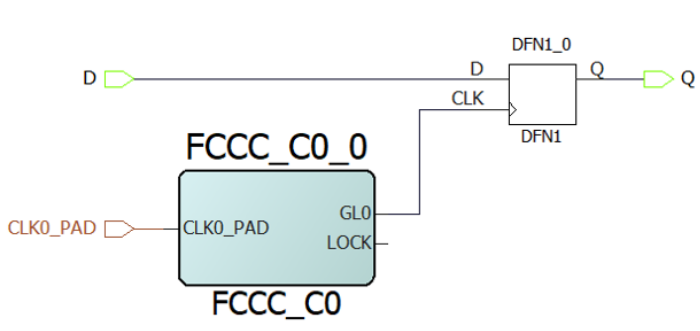

# set\_clock\_to\_output

## Description

Defines the timing budget available inside the FPGA for an output relative to a clock.

This non-standard sdc command is intended to constrain an output flip-flop clock-to-output time. This command is only honored by Libero SoC Timing analysis engine. It is not honored by Libero SoC Place and Route, Synplify Synthesis, or any other sdc-compliant synthesis tool. Timing analysis is performed from the initial clock source. If sdc-compliant commands are desired, see [set\_max\_delay](GUID-CDCFAAE7-BB67-4F0A-9E54-88F759325E05.md), [set\_min\_delay](GUID-244CC545-2A74-4548-8861-D493EAB878BA.md), and [set\_output\_delay](GUID-49ECB461-9EA4-4725-9F17-20ED7C4A216C.md).

The clock argument for this command must be set to the actual clock driving the output flip-flop.

```
set_clock_to_output delay_value -clock clock_ref [–max] [–min] output_list
```

## Arguments

<table id="GUID-8039BCE9-0680-4D7B-B5E9-61118B8BFFF9"><thead><tr><th>

Parameter

</th><th>

Type

</th><th>

Description

</th></tr></thead><tbody><tr><td>

`delay_value`

</td><td>

integer

</td><td>

Specifies the clock to output delay in nanoseconds. This time represents the amount of time available inside the FPGA between the launch clock edge and the data change at the output port.

</td></tr><tr><td>

`clock`

</td><td>

string

</td><td>

Specifies the clock to which the specified clock to output is related. This is a mandatory argument.**Note:** The clock parameter needs to be set to the clock driving the FF. If it is a generated clock, STA is performed from the initial clock source.

</td></tr><tr><td>

`max`

</td><td>

None

</td><td>

Specifies that delay\_value refers to the maximum clock to output at the specified output. If you do not specify `–max` or `–min` options, the tool assumes maximum and minimum clock to output constraint values to be equal.

</td></tr><tr><td>

`min`

</td><td>

None

</td><td>

Specifies that delay\_value refers to the minimum clock to output at the specified output. If you do not specify `–max` or `–min` options, the tool assumes maximum and minimum clock to output constraint values to be equal.

</td></tr><tr><td>

`output_list`

</td><td>

list of strings

</td><td>

Provides a list of output ports in the current design to which `delay_value` is assigned. If you need to specify more than one object, enclose the objects in braces \(\{\}\).

</td></tr></tbody>
</table>## Error Codes

|Error Code|Description|
|----------|-----------|
|None|Required parameter -clock is missing|

## Supported Families

<table id="GUID-56F9E300-6CAB-48D0-9D92-B4EC8F62D904"><tbody><tr><td>

PolarFire®

</td></tr><tr><td>

PolarFire SoC

</td></tr><tr><td>

SmartFusion® 2

</td></tr><tr><td>

IGLOO® 2

</td></tr><tr><td>

RTG4™

</td></tr></tbody>
</table>## Examples

The following example sets an output delay of 0.3 ns for port Q relative to the clk clock.

```
set_clock_to_output -max 0.3 -clock { clk } [ get_ports { Q } ]
```

The following example sets an output delay of 12 ns for port Q relative to the FCCC\_C0\_0/FCCC\_C0\_0/GL0 clock. Timing analysis will be performed from the CLK0\_PAD clock source, assuming that there is a “create\_clock” on CLK0\_PAD and a “create\_generated\_clock” on FCCC\_C0\_0/FCCC\_C0\_0/GL0 whose source is defined as the CCC reference clock CLK0\_PAD. It is recommended to use the supplied SDC constraints generated with the configured CCC core. The supplied SDC constraints can be added to the top-level design using the Derive Constraints action in the Libero SoC Constraints Manager or using the Derive Constraints utility described in the [Custom Flow User Guide](https://coredocs.s3.amazonaws.com/Libero/2025_1/Tool/libero_custom_flow_ug.pdf)

``` {#CODEBLOCK_RZW_RBD_3YB}
set_clock_to_output -max 12 -clock { FCCC_C0_0/FCCC_C0_0/GL0 } [ get_ports { Q } ]
```



## Related Examples on GitHub

-   [set\_clock\_to\_output](https://github.com/MicrochipTech/Libero-SoC-Design-Suite-Tcl-Examples/tree/basic_tcl_examples/SmartTime/set_clock_to_output)

**Parent topic:**[SmartTime Tcl Commands](GUID-96623DD0-9D90-4AFA-90C3-B2BAEEE15670.md)

