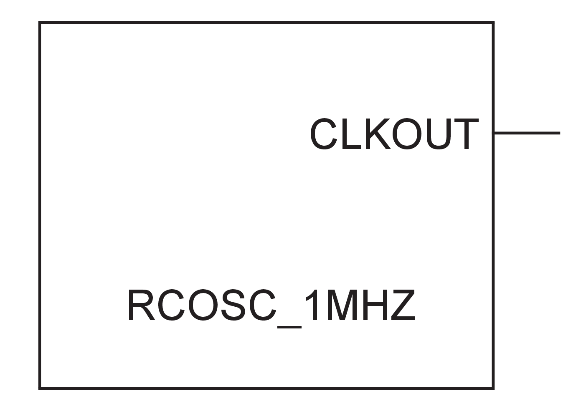
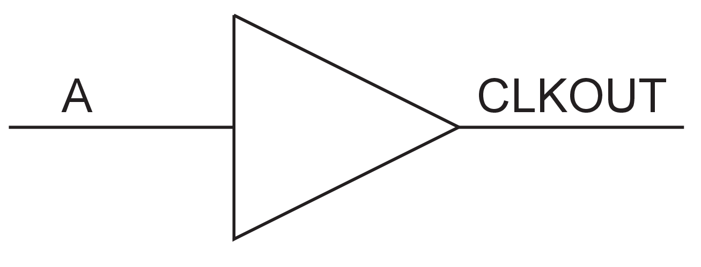
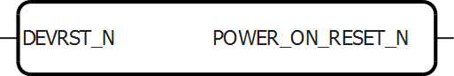
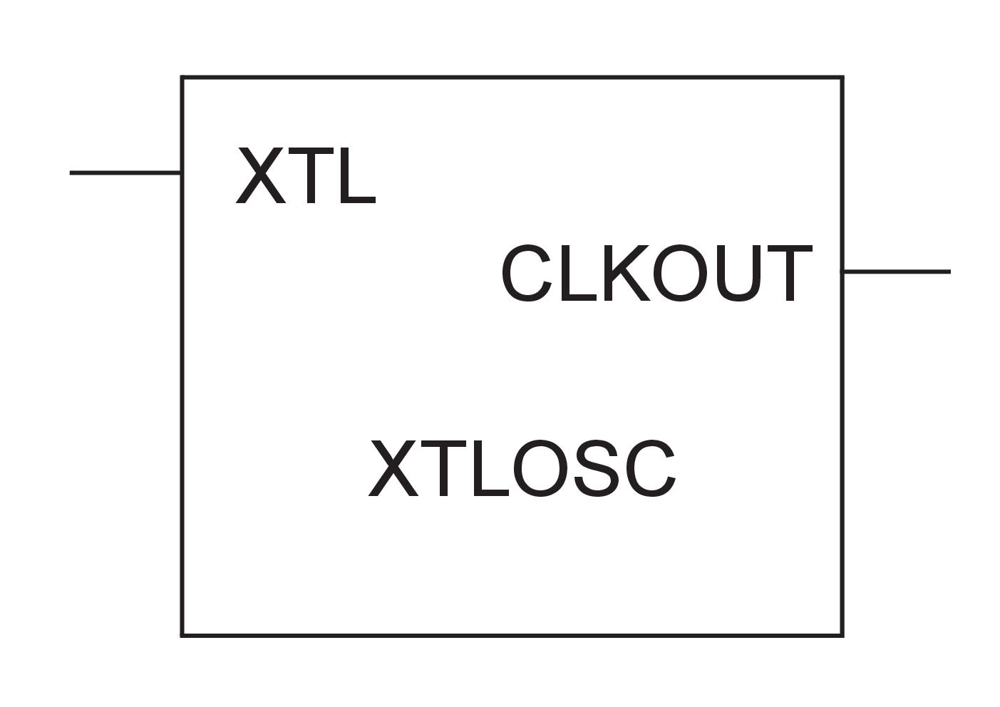

# Special

## FCEND\_BUFF

Buffer, driven by the FCO pin of the last macro in the Carry-Chain.

 

 

|Input|Output|
|-----|------|
|A|Y|

|A|Y|
|---|---|
|0|0|
|1|1|

## FCINIT\_BUFF

Buffer, used to initialize the FCI pin of the first macro in the  Carry-Chain.

 

 

|Input|Output|
|-----|------|
|A|Y|

|A|Y|
|---|---|
|0|0|
|1|1|

## FLASH\_FREEZE

The Flash\_Freeze macro is a special-purpose macro that provides  information on when the chip is about to go into Flash\* Freeze mode to allow the user to  perform any housekeeping needed before the device enters into Flash\*Freeze mode. The  macro has two outputs:

-   FF\_TO\_START—This signal goes high when the FPGA is about to go into Flash\*Freeze mode.
-   FF\_DONE—This signal goes high when the FPGA has successfully entered Flash\*Freeze mode.

For more information about this macro, see the [UG0450: SmartFusion2 and IGLOO2 System Controller User Guide](https://ww1.microchip.com/downloads/aemDocuments/documents/FPGA/ProductDocuments/SoC/microsemi_smartfusion2_igloo2_system_controller_user_guide.pdf) and the [SmartFusion2 and IGLOO2 FPGA Low-Power Design User Guide](https://ww1.microchip.com/downloads/aemDocuments/documents/FPGA/ProductDocuments/SoC/microsemi_smartfusion2_igloo2_fpga_low_power_design_user_guide_ug0444_v5.pdf).

There is no simulation model for this macro. The two outputs remain low  during simulation because Flash-Freeze is not supported during simulation.

## LIVE\_PROBE\_FB

This is a special-purpose macro that feeds the live probe signals back to the fabric. You can connect the PROBE\_A/PROBE\_B signals to any unused I/O during design generation. This is useful if PROBE\_A/PROBE\_B cannot be brought out for debugging due to board limitations. PROBE\_A and PROBE\_B pins must be reserved, if LIVE\_PROBE\_FB macro is used. This macro is not supported in simulation.

## RCOSC\_1MHZ

The RCOSC\_1 MHZ oscillator is an RC oscillator that provides a free  running clock of 1 MHz frequency.

 

 

## RCOSC\_1MHZ\_FAB

The RCOSC\_1 MHZ\_FAB macro provides an interface from the RCOSC\_1 MHZ  oscillator to fabric logic.

 

 

## RCOSC\_25\_50MHZ

The RCOSC\_25\_50 MHZ oscillator is an RC oscillator that provides a free  running clock of 25 MHz \(at 1.0V supply voltage\) or 50 MHz \(at 1.2V supply voltage\).

 

 

## RCOSC\_25\_50 MHZ\_FAB

The RCOSC\_25\_50MHZ\_FAB macro provides an interface from the RCOSC\_25\_50MHZ  oscillator to fabric logic.

 

 

## SYSCTRL\_RESET\_STATUS

This special-purpose macro checks the status of the System Controller. The RESET\_STATUS output port goes high when the System Controller is in reset mode. To enable this, select the "System Controller Suspend Mode" option in the "Device Settings" under Libero's Project Settings.

**Important:** This macro does not support simulation. To simulate the System Controller suspend mode, add the following pseudo-code to the simulation testbench:

-   At simulation time t = 0, set `RESET_STATUS` = 0.
-   X[1](#SUP_XZV_1MQ_PCC) μs after observing `POWER_ON_RESET_N` = 1, set `RESET_STATUS` = 1 to indicate that the system controller has entered suspend mode.

1The current supported simulation is a fast simulation. In this environment X = 12.12 μs. The current supported simulation is a fast simulation where X = 12.12 μs. For more information about the system-level simulations that include power supply ramp time and actual delay times, see power-up to functional times in the [DS0128: IGLOO2 and SmartFusion2 Datasheet](https://ww1.microchip.com/downloads/aemDocuments/documents/FPGA/ProductDocuments/SoC/microsemi_smartfusion2_and_igloo2_datasheet_ds0128_v12.pdf). In this environment, X = TVDD2OUT + 5 μs or X = TDEVRST2OUT + 5 μs.

## SYSRESET

SYSRESET is a special-purpose macro. The Output POWER\_ON\_RESET\_N goes low  at power-up and when DEVRST\_N goes low.

|Input|Output|
|-----|------|
|DEVRST\_N|POWER\_ON\_RESET\_N|

|DEVRST\_N|POWER\_ON\_RESET\_N|
|---------|-------------------|
|0|0|
|1|1|

## XTLOSC

The crystal oscillator provides up to a 20 MHz clock signal. Physically, it requires connection to an external crystal. However, for simulation purposes the XTL pin provides a clock signal running at the desired input frequency. MODE is a two-bit configuration parameter that specifies the frequency range, as shown in the following table.

|MODE\[1:0\]|Frequency Range \(MHz\)|
|-----------|-----------------------|
|00|N/A|
|01|0.032 – 0.075|
|10|0.075 – 2.0|
|11|2.0 – 20.0|

## XTLOSC\_FAB

The XTL\_OSC\_FAB macro provides an interface from the crystal oscillator  \(XTLOSC\) to fabric logic.

 

 

