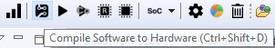

# SmartHLS License

Learn how to obtain a free license for SmartHLS.

## License Setup Instructions

Starting version 2024.2, SmartHLS no longer requires a separate  license. SmartHLS is supported using the Libero SoC Design  Suite license.

For SmartHLS 2024.1 and earlier, you need to upgrade your  Libero license. Your upgraded Libero license is available for download after the release  of Libero SoC 2024.2. With the upgraded Libero license, you can use SmartHLS 2024.1 and earlier without a separate SmartHLS license.

To download your upgraded Libero license, log on to your [Microchip Direct](https://www.microchipdirect.com/fpga-software-products) account. For instructions on how to setup a  Libero license, see the Libero SoC Software Download and License Installation Guide  [License Installation](GUID-40BFB012-128A-4850-8C3C-FE907B6FCD5D.md).

If you face any licensing issues while running SmartHLS, make sure that you have a valid Libero license available.

## When is the License Checked?

SmartHLS™ does not check the license when opening the SmartHLS IDE or when running the standard software flow \(compiling/debugging/execution\).

SmartHLS will check for a valid license when **Compile Software to Hardware** is clicked to compile software to hardware:

SmartHLS will also check for a valid license whenever running shls commands from the [SmartHLS Command-Line Interface](Chunk120481216.md#).

