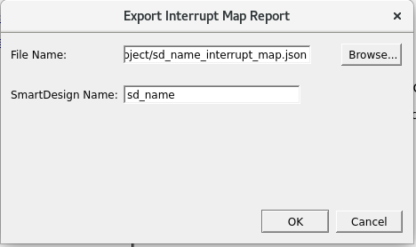

# Exporting Interrupt Map Report

The **Export Interrupt Map Report** allows exporting the necessary data about<br /> the interrupt pin connections. It contains the data about MSS and MIV interrupt pins and<br /> their drivers. In particular, the hierarchical path to both pins, their instances, and the<br /> components where they are located. Besides for the connectivity information, the Platform<br /> Level Interrupt Controller \(PLIC\) number is also exporting for each MSS interrupt pin. The<br /> **Interrupt Map Report** functionality supports the<br /> **PFSOC\_MSS** components and the **MIV**<br /> processors.

To export the interrupt map report, perform the following steps:

1.  On the menu, click **File** &gt; **Export** &gt; **Export Interrupt Map Report**. The **Export Interrupt Map Report** dialog box appears.


    

2.  Click **OK**. A `.json` formatted interrupt map report file is created, which you can open in any text editor.

    **Note:** You can choose to the export the interrupt map to a different location and with a different filename as required.


**Sample Interrupt Map Report**

``` {#CODEBLOCK_UJ1_RQP_PWB}
{
   "version":"0.1",
   "title":"Interrupt Map Report",
   "date":"Mon Jan 01 00:00:00 2022",
   "project_name":"my_project",
   "project_location":"/home/user/Projects/my_project",
   "SmartDesign name":"MPFS_ICICLE_KIT_BASE_DESIGN", /* The SmartDesign for which the report is being exported. */
   "Processor interrupt map":[
      {
         "Processor instance":"ICICLE_MSS_0", /* If the MSS instance is located in the top level SmartDesign the name of the instance should not be hierarchical. */
         "Processor component":"ICICLE_MSS",
         "Component type":"MSS",
         "Interrupt connection map(Interrupt pin name - Hierarchical driver pin name)":[
            {
               "Interrupt pin":"MSS_INT_F2M[0]",
               "PLIC":"118",
               "Driver pin":"Y", /* If the driver pin is located in the top-level SmartDesign, the name of it should not be hierarchical. */
               "Driver component":"", /* If the driver pin is located in the top-level SmartDesign, need to leave this field empty. */
               "Driver instance":"" /*  If the driver pin is located in the top-level SmartDesign, need to leave this field empty. */
            },
            {
               "Interrupt pin":"MSS_INT_F2M[1]",
               "PLIC":"119",
               "Driver pin":"PCIE_1_INTERRUPT_OUT",
               "Driver component":"",
               "Driver instance":""
            },
            {
               "Interrupt pin":"MSS_INT_F2M[2]",
               "PLIC":"120",
               "Driver pin":"INTERRUPT",
               "Driver component":"",
               "Driver instance":""
            },
            {
               "Interrupt pin":"MSS_INT_F2M[3]",
               "PLIC":"121",
               "Driver pin":"mBUS_INT",
               "Driver component":"",
               "Driver instance":""
            },
            {
               "Interrupt pin":"MSS_INT_F2M[4]",
               "PLIC":"122",
               "Driver pin":"INT",
               "Driver component":"",
               "Driver instance":""
            },
            {
               "Interrupt pin":"MSS_INT_F2M[59]",
               "PLIC":"177",
               "Driver pin":"IHC_SUBSYSTEM_0/U54_4_IRQ_AGGREGATOR:IRQ",
               "Driver component":"MIV_IHCIA",
               "Driver instance":"IHC_SUBSYSTEM_0/U54_4_IRQ_AGGREGATOR" /* The hierarchical path to the driver instance. */
            },
            {
               "Interrupt pin":"MSS_INT_F2M[60]",
               "PLIC":"178",
               "Driver pin":"IHC_SUBSYSTEM_0/U54_3_IRQ_AGGREGATOR:IRQ",
               "Driver component":"MIV_IHCIA",
               "Driver instance":"IHC_SUBSYSTEM_0/U54_3_IRQ_AGGREGATOR"
            },
            {
               "Interrupt pin":"MSS_INT_F2M[61]",
               "PLIC":"179",
               "Driver pin":"IHC_SUBSYSTEM_0/U54_2_IRQ_AGGREGATOR:IRQ",
               "Driver component":"MIV_IHCIA",
               "Driver instance":"IHC_SUBSYSTEM_0/U54_2_IRQ_AGGREGATOR"
            },
            {
               "Interrupt pin":"MSS_INT_F2M[62]",
               "PLIC":"180",
               "Driver pin":"IHC_SUBSYSTEM_0/U54_1_IRQ_AGGREGATOR:IRQ",
               "Driver component":"MIV_IHCIA",
               "Driver instance":"IHC_SUBSYSTEM_0/U54_1_IRQ_AGGREGATOR"
            },
            {
               "Interrupt pin":"MSS_INT_F2M[63]",
               "PLIC":"181",
               "Driver pin":"IHC_SUBSYSTEM_0/E51_IRQ_AGGREGATOR_0:IRQ",
               "Driver component":"MIV_IHCIA",
               "Driver instance":"IHC_SUBSYSTEM_0/E51_IRQ_AGGREGATOR_0"
            }
         ]
      }
   ]
}
```

