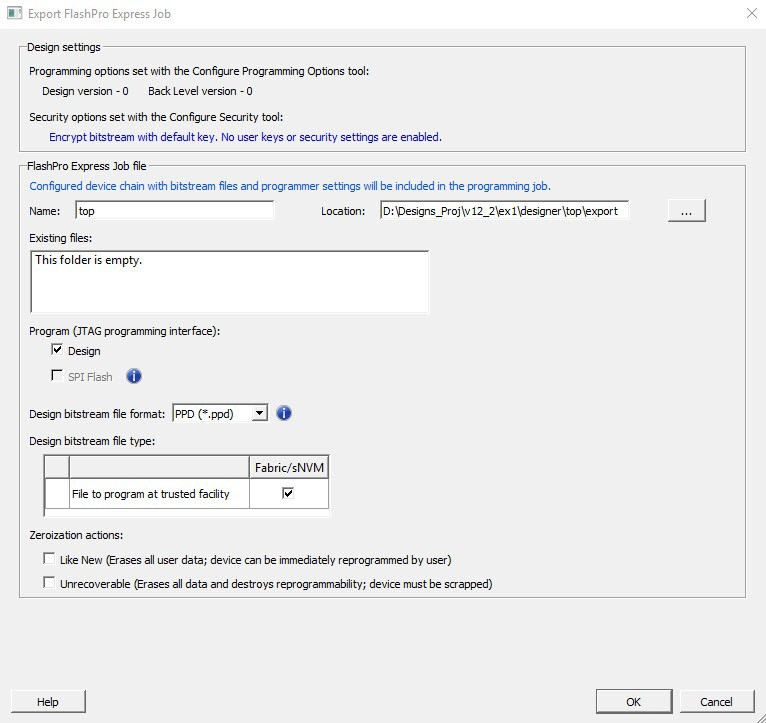
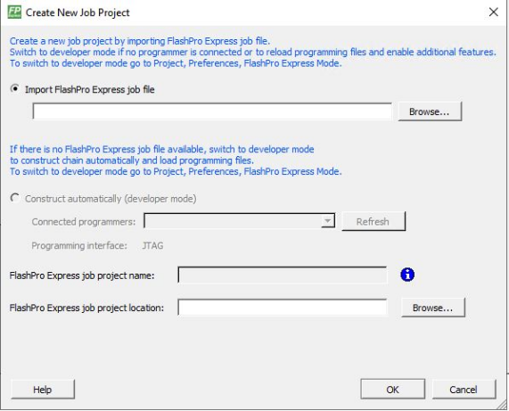
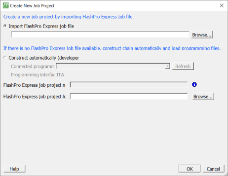
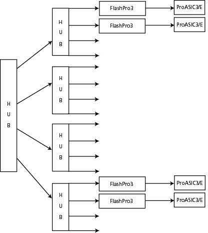

# Getting Started

This section describes how to get started using FlashPro Express.

## Starting FlashPro Express

FlashPro Express software is available in the `<Libero SoC installation folder>\bin` folder. Execute the `FPExpress` file to launch  the FlashPro Express software.

## FlashPro Express Interface

The main FlashPro Express UI consists of a list of programmers and a chain table. This  view displays the programmers connected to the machine, and the devices within the JTAG  chain \([Figure 4-1](GUID-062A99C1-F516-44C9-B2E6-873720F7DE16.md#FIG_OXQ_B3X_PNB)\) or a single  device with SPI Target interface \([Figure 4-2](GUID-062A99C1-F516-44C9-B2E6-873720F7DE16.md#FIG_WLV_D3X_PNB)\) specified in the job project file \(PRO\) file.

")

The following table describes the FlashPro actions you can perform. Devices specified as  disabled in the job project \(`*.pro`\) file are shown disabled and their  HighZ value appears in the column header.

|To...|Perform This Action...|
|-----|----------------------|
|Display more information about a programmer.|Hover over the programmer Info icon.|
|Change a programmer name.|Click the **Name** field.|
|Enable or disable a programmer.|Click the check box.|
|Ping, Self-Test, Scan, Check Chain, or Remove it from the  list.|Right-click a programmer.|
|View additional information about a device and programming file, if  loaded.|Hover over the info icon of that device.|

The following table describes the device/programmer states.

|Device/Programmer State|Description|
|-----------------------|-----------|
|IDLE|Devices and programmers are idle and not executing any programming  action.|
|DISABLED|Devices that are not enabled for programming.|
|PASSED|Last programming operation passed.|
|FAILED|Last programming operation failed.|

 

**Note:** SPI Target mode is supported by FlashPro5 for SmartFusion 2 and IGLOO 2 devices, and by FlashPro6 for SmartFusion 2, IGLOO 2, and PolarFire devices. JTAG is the default interface. RTG4 devices do not support SPI Target programming.

 

## Creating a Job Project

When you are ready to hand off your design for production, create a job project.

1.  In Libero, run **Export FlashPro Express Job** to create a container that will be used to transfer programming configuration information, including programming files, to the production programming tool FlashPro Express.

    

2.  In FlashPro Express, from the **Project** menu, choose **New Job Project**.
3.  When prompted, specify the Programming Job file location that you just exported from Libero and the location to store the FlashPro Express job project. The job project name uses the programming job name and cannot be changed. Click **OK** to create and open a new job project for production programming.

The user can create a new FlashPro Express job project without connecting hardware. After the job  project is created, it can be modified by adding, removing devices, loading programming files,  and so on.

**Important:** You can use any `.job` file to create a new job when there are no programmers connected.

The user can create, a new job project using **Construct automatically**  option. This option can be used to construct chain by scanning the physical chain connected to  the selected programmer. This feature is available only in JTAG mode. If multiple programmers  are connected to the machine, select the desired programmer by clicking on the drop down menu  for connected programmers field.

## Opening a Job Project

To start with FlashPro Express, load a job project \(`*.pro`\) file.

To open a job project:

1.  From the **Project** menu, choose **Open Job Project**. The Open Project dialog box appears.
2.  Find your project file or type in your project file name in the **File name** field.
3.  Click **Open**.

In the Operator mode, a job project opens if the physical chain containing at least one Microchip device is connected. The Developer mode does not have any restrictions.

To update device\(s\), you can:

1.  Use the **Device Configuration** menu to update the device.
2.  Open the **Programming Connectivity and Interface** dialog to update the chain/devices.
3.  Connect a programmer, and click on **Refresh/Rescan Programmers** to enable programmers/devices and run programming.

## Saving a Job Project

To save a job project, either:

-   Click the **Save**button on the toolbar, or
-   From the **Project**menu choose **Save Job Project**.

## Programming Tutorials

The following programming tutorials describe real-world examples of using FlashPro.

### Parallel Programming with FlashPro5/4/3/3X

Parallel programming allows you to program multiple Microchip devices in parallel with multiple  programmers. In parallel programming, all targeted devices are programmed with the same  programming file \(STAPL\). The targeted device or chain configuration that is connected  to each programmer must be identical.

The FlashPro Express software together with the FlashPro5/4/3/3X programmers supports parallel programming via a USB port. You can connect up to sixteen FlashPro5/4/3/3X's to a PC via a USB v1.1 or a USB v2.0 port.

FlashPro5/4/3/3X requires a self-powered hub.

Connecting FlashPro5/4/3/3X \(a USB v2.0 enabled programmer\) to USB v1.1 port increases device programming time due to a slow data transfer rate on the USB v1.1 port in comparison to a USB v2.0 port.

The following figure shows how to connect a FlashPro5/4/3/3X programmer for parallel  programming.

An independent thread processes the STAPL file during parallel programming. In a Microchip test  environment, parallel programming is approximately five times faster than programming 16  devices sequentially.

**Note:** Microchip has tested Belkin PCI-USB cards and hubs, and found that parallel programming works best when using the vendor's latest driver installed along with matching hubs.

### Chain Programming Tutorial

This tutorial describes how to use FlashPro Express to program a multi-device, multi-programmer  chain. This tutorial uses the production programming flow that exports a programming job  from Libero SoC, which includes chain configuration, programmer settings, and bit stream  files for programming, and creates a job project from a programming job.

The following figure shows the chain used in this tutorial. M2S050T is device 1 and A3P250 is  device 3.

-   Device 1 is the first device to be programmed in the chain.
-   Device 2 is the last device to be programmed in the chain.
-   Device 3 is disabled and will not be programmed.

To program a chain:

1.  From the **Project**menu, choose **New Job Project from FlashPro Express Job**.
2.  Click **Browse**to load a Programming Job File, and specify your **FlashPro Express job project location**. Click **OK**to continue, as shown in the following figure.

    

    FlashPro Express displays your Job Project and programmers, as shown in the  following figure. The Device/Programmer states are:

    -   IDLE: Devices/programmers are idle and not executing any programming action.
    -   DISABLED: Devices that are not enabled for programming.
    -   PASSED: Last programming operation passed.
    -   FAILED: Last programming operation failed.
    ")

    ")

3.  If your programmer is not listed, click the **Refresh/Rescan** button. To view device info, hover your mouse over the **Info** icon. If a device is Disabled for programming, the HighZ status appears in the GUI.
4.  Set the Programming Action in the drop-down menu to **PROGRAM**, as shown in the following figure.

    

5.  Click **RUN**. Detailed individual programmer and device status information appears in the Programmer List. Your programmer status \(PASSED or FAILED\) appears in the Programmer Status Bar, as shown in the following figure.

    -   Hover over the Programmer Status Bar to display information on the programmers.
    -   Hover over the FAILED status to list all programmers that failed programming.
    -   Hover over the PASSED status to list all the programmers that programmed successfully.
    

6.  View the **Log**for Messages, Errors, Warnings and Info generated during programming.

