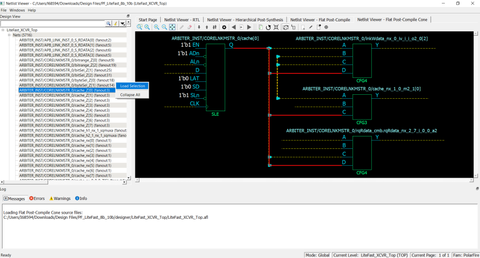

# Adding a Net

Right click a net in the Design Tree and select **Load Selection** to add a net to the view. Adding a net to the view adds a solid  line net to the view \(unless you cancel early\), including all the instances and ports the  net is connected to. The added net is selected in the view.

Nets that span multiple pages can be followed through the right click menu  item **Follow Net to Page\#** to go to different pages that the net is  on.

**Parent topic:**[Displaying the Flat Post-Compile Cone View](GUID-30D775AD-ED75-4835-81B5-C7B252DB402A.md)

