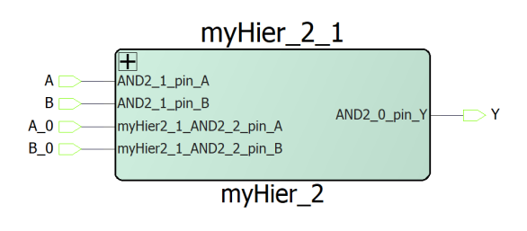
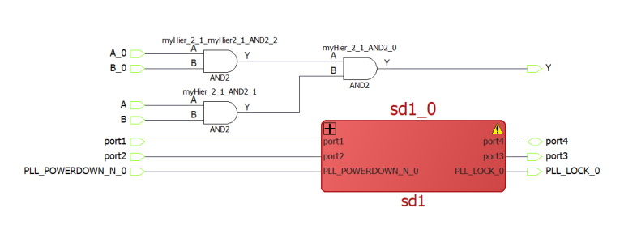
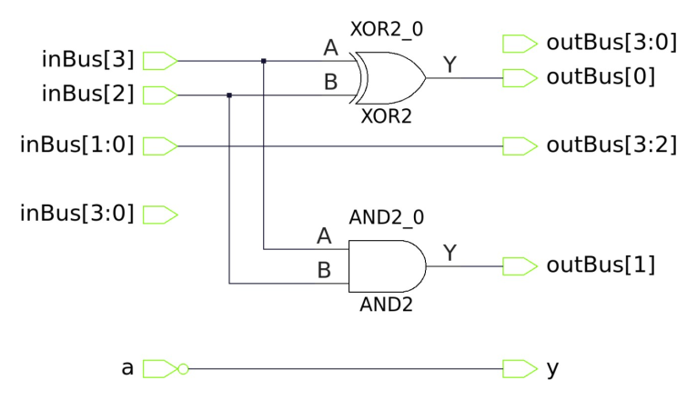
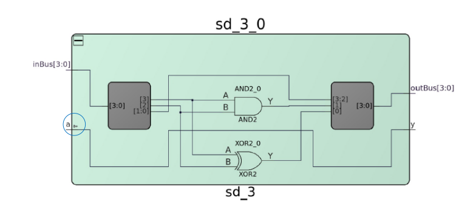

# Working with Hierarchical SmartDesigns

A hierarchical SmartDesign is a better way to organize your main top level design.  In the hierarchical approach, your top level design can have multiple sub-components or  blocks. Each sub-component in turn can be expanded or collapsed to view the additional  sub-components of your design with their own building blocks.

The nested structure allows you to traverse up or down your main design. The  SmartDesign tool automatically takes care of any data conflicts and makes it easier to manage  the instances in your design.

## Creating a Hierarchical SmartDesign

This feature allows you to select one or more instances in your SmartDesign and create a new  SmartDesign out of it \(all the nets and connections from the instance are retained\). This  feature helps you organize a complicated design by creating sub-components on the fly from  within the current SmartDesign canvas.

To create a new hierarchical SmartDesign, perform the following steps:

1.  Select one or more design object\(s\) in your SmartDesign.
2.  Right-click any selected design object\(s\) and select **Create Hierarchical SmartDesign** from the right-click menu. The **Create New Hierarchical SmartDesign** dialog box appears.

    ")

    **Important:** The selected portion must contain at least one instance.

3.  In the **Name** box, enter an appropriate unique name for the hierarchy and click **OK**.

    **Result:** A new SmartDesign component is created with the  specified name and all the selected items are cut and pasted in the new  SmartDesign.

    The newly created SmartDesign is automatically instantiated in the  SmartDesign canvas, the sub-design is replaced with the new SmartDesign component, and all  the connections are restored.

A error message is printed in the **Log** window depending on the following  scenarios.

|Scenario|Message|
|--------|-------|
|If another component or HDL module with the same name already exists in the  project.|`Error: SmartDesign with the specified name already exists. Please specify a different name.`|
|If the specified name violates any HDL naming rules.|`Error: Cannot create hierarchical SmartDesign '[specified_name]' because it violates HDL naming rules. Please specify a different name.`|

**Important:** The following conventions are followed while creating a hierarchical SmartDesign:

-   Default name of a hierarchical SmartDesign is: `*hier\_\[index\]*`.
-   Ports are created in the hierarchical SmartDesign for all the unconnected instance pins.
-   Port names are created for the Hierarchical SmartDesign using the following syntax: `*\[instance\_name\] + \_pin\_ + \[pin\_name\]*`.
-   PAD ports do not follow the same naming rules and are promoted to top level automatically.
-   If a port name already exists, index suffix is added to the name.
-   Sliced ports are created similarly to the regular bus ports.
-   A hierarchical SmartDesign can be created out of a single instance.
-   Creating a hierarchical SmartDesign out of the ports is not allowed. At a minimum, one instance must be selected.

")

## Flattening a Hierarchical SmartDesign

The **Flatten Hierarchical SmartDesign** operation extracts all the objects  from the hierarchical SmartDesign and places them at the top-level while keeping all inner and  outer connections, attributes, slices, and exposed pins.

To flatten a hierarchical SmartDesign, right-click any hierarchical SmartDesign instance and  select **Flatten Hierarchical SmartDesign**.

**Result:** All the objects from the selected hierarchical SmartDesign are  extracted and placed at the at the top-level while keeping all inner and outer connections,  attributes, slices, and exposed pins.

The following modifications are applied to the flattened design:

-   If there is an inverted pin in the hierarchical instance and a corresponding port or pin \(or both\) from the hierarchical SmartDesign is also inverted, the resulting pin is inverted if inversion count is odd else it is not inverted.
-   When there is an inverted pin in the hierarchical SmartDesign and the corresponding pin from the hierarchical instance has another attribute \(tied high or low\), the inversion count is odd and the tied attribute flips.
-   Internal nets and inner instances are renamed as `<Hierarchical instance name> + _ <Internal net name or inner instance name>`.
-   After flattening hierarchical SmartDesign, synthesis attributes of the outer and inner nets are merged. If both have the same attribute, the value of the outer net is used.

**Important:** The following conventions are followed while flattening a hierarchical SmartDesign:

-   The selected instance is removed
-   All the instances are copied from the hierarchical SmartDesign component to the current SmartDesign
-   All the connections, attributes, slices, and exposed pins are restored automatically

## Expanding and Folding Instances

The **Expand Instance** and **Fold Instance**  functionality enables you to traverse up or down the design hierarchy of a SmartDesign  component.

The **Expand Instance** functionality enables you to traverse one level down  of the hierarchy for viewing, while the **Fold Instance** functionality  allows you to collapse to the next higher-level. Expanding and folding of an instance is  executed in place within the canvas.

**Important:** Instance is read-only in the expanded view.

A folded design is indicated by a **+** symbol and an expanded design is  indicated by a **-** symbol at the top-left corner of the instance.

To expand a folded design, click the **+** symbol. The folded instance is  expanded to the next lower level of the hierarchy. Alternatively, right-click the instance and  select **Expand Instance** in the right-click menu.

To fold and expanded design, click the **-** symbol. The expanded instance  is folded to the next higher-level of the hierarchy. Alternatively, right-click the instance  and select **Fold Instance**.

When a lower-level component is modified, all the parent components containing modified component  are marked with an asterisk **\(\*\)** adjacent to their names. The modified  component is highlighted in red, and a status icon is displayed in the instance's top-right  corner.

**Important:**

-   The red highlight and the **warning icon**appears only after the higher level component\(s\) are folded or expanded to expose the changed lower-level component.
-   Instead of **ports changed**, the error becomes a **missing module** when a lower-level SmartDesign component instantiated in a higher-level module or component is deleted from the project.

If a changed, missing module, or component is at the lowest level of the hierarchy, the  **Update Instance** and **Generate Components** steps  must be repeated at every level of hierarchy on the top of the changed module or component  until the top-level hierarchy is reached, updated, and regenerated.

The **Expanded View**does not reflect changes to the lower-level design in  real time. To see the updated view, you must collapse the hierarchy and expand it again.

The top-level ports in the low-level components are shown differently in the **Expanded Inplace View** if the following are top-level ports:

In the **Expanded Inplace View**, an inverter symbol is displayed next to the  port \(circled in the preceding figure\) for inverted ports. For the slice ports in this view, a  slicer instance is inserted for each sliced bus.

