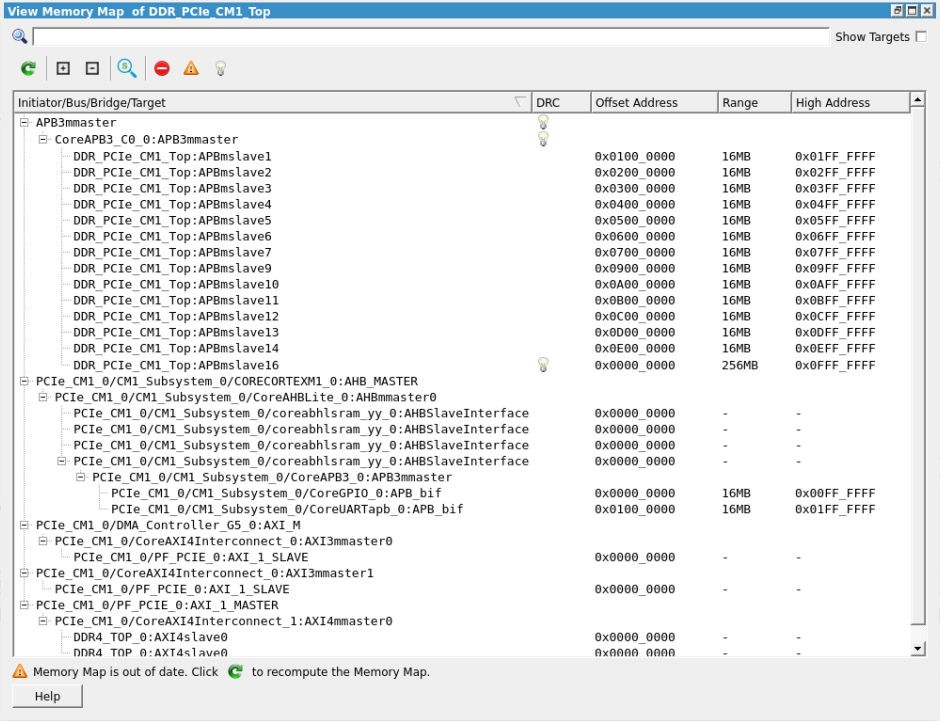
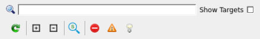

# Viewing the Design Memory Map

The **View Memory Map** toggle window displays the memory map  corresponding to various initiators in the SmartDesign component and displays each initiator  to target\(s\) connectivity path in a tree format. To open the window, click **View Memory Map** icon in the SmartDesign toolbar. The dockable **View Memory Map** window appears to the right side of the canvas.

This window shows the memory map starting from an initiator in the design to targets connected through bus and bridge cores. There can be various types of bus and bridge cores in the path from initiators to targets.

-   **Initiator Node** &gt; **Bus** &gt; **Bridge** &gt; **Bus** &gt; **Targets**
-   **Initiator Node** &gt; **Bus** &gt; **-Targets**

**Important:** The memory map also considers initiators, bus and bridge cores, and targets that are present in other SmartDesign components, which are instantiated under the current SmartDesign’s hierarchy.

Each target in the memory map is shown with an Offset Address, Range, High Address, and DRC. If the Memory Map DRC detects a partially invalid or invalid structure, an Error or a Warning icon with a tooltip message is shown. DRC is flagged if a target cannot be accessed completely or partially by the initiator’s address space.

DRC errors in the Memory Map corresponding to a SmartDesign component and its hierarchy are  flagged when the SmartDesign component is generated and are printed as messages to the  **Log**window. If DRC are warnings, the SmartDesign component generation  passes. However, if the DRCs are errors, the SmartDesign component generation fails. There is  an option to downgrade Memory Map DRC errors to warnings and let the SmartDesign component  generation to go through without failing. To set these options, open the **Libero SoC Project Settings SmartDesign** page.

 Errors to Warnings")

**Important:** If Memory Map errors are downgraded to warnings using the preceding preference check box, the targets flagged by the DRC error cannot be accessed by the Initiator they are connected to. Check each DRC warning and ensure that there are no issues before going further in the design flow.

The **View Memory Map** window also provides buttons and filters at the top of  the window for easy navigation and ease of use.

-   **Search**: Searches for a specific initiator, bus, bridge, and target in the memory map by specifying a full or partial name in the search box.
-   **Show Targets**: Shows all the initiator to target\(s\) paths without the buses and bridges that connect them with their start addresses, ranges, and DRCs if any. The initiators, bus, and bridge cores are not shown.
-   **Refresh**: Updates the content of the Memory map. It becomes active only when something is changed on canvas.
-   **Expand**: Expands and shows the full path of all the initiators in the memory map starting from the initiator to the targets.
-   **Collapse**: Collapses the memory map tree and only shows the initiators in the window.
-   **Zoom and Center**: Toggle action. If checked, the canvas zooms to the selected item after every selection.
-   **DRC Filters**: It filters the DRC messages, if any. It categorized the message on the basis of severity: error, warning, and information.

Additional Memory Map functions allow you to sort items by their offset or high addresses and ranges.

1.  Click the columns of the header to sort the items in ascending or descending order.
2.  Click the first column of the header to see the initial view of the table.

