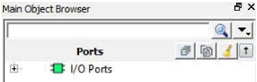

# Object Window

The Object window \(Main Object Browser\) includes the following tabs:

-   Port
-   Logical
-   Net
-   Region

Press **Ctrl+F**to open a floating window for the  active tab. See the following example.

The following table lists the Object window icons.

|**Description**|
|---------------|
|Collapse everything in the tree.|
|Expand selected.|
|Clear the filter and refresh the tree  reflecting no filters.|
|Change sort order and allow additional  filtering.|

**Parent topic:**[Other I/O Editor Windows](GUID-A5B625D0-E38D-4817-90D7-344E263F7AA6.md)

