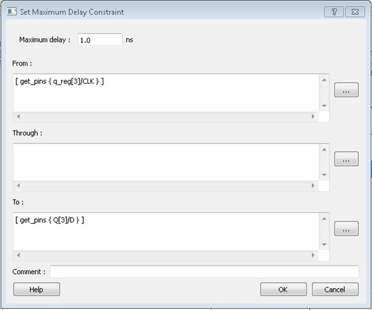
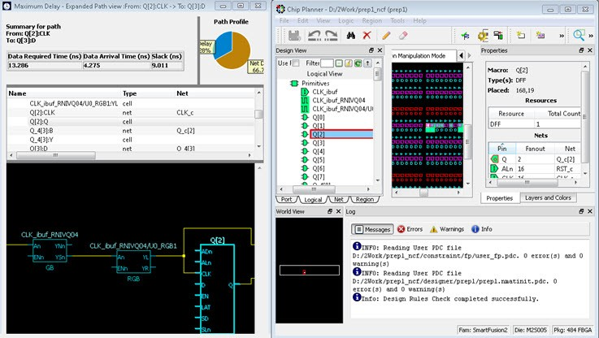
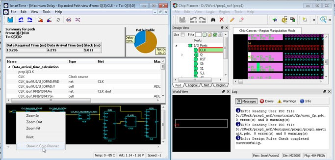
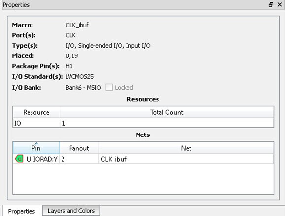

# Timing Concepts

The following sections describe timing concepts associated with the RTG4 FPGA Clock Conditioning  Circuit with PLL configuration.

## Static Timing Analysis Versus Dynamic Simulation

Static Timing Analysis \(STA\) offers an efficient technique for identifying timing violations in  your design and ensuring that it meets all your timing requirements. You can communicate  timing requirements and timing exceptions to the system by setting timing constraints. Then a  static timing analysis tool checks and reports setup, and holds violations and violations on  specific path requirements.

STA is well suited for traditional synchronous designs. The main advantage of STA is that, unlike  dynamic simulation, it does not require input vectors. It covers all possible paths in  the design and does all the above with relatively low run-time requirements. The major  disadvantage of STA is that the STA tools do not automatically detect false paths in  their algorithms.

## Delay Models

The first step in timing analysis is the computation of single component delays. These components  can be either a combinational gate or block or a single interconnect connecting two  components.

Gates that are part of the library are pre-characterized with delays under different parameters, such as input-slew rates or capacitive loads. Traditional models provide delays between each pair of I/Os of the gate and between rising and falling edges.

The accuracy with which interconnect delays are computed depends on the design phase. These can  be estimated using a simple Wire Load Model \(WLM\) at the pre-layout phase or a more  complex Resistor and Capacitor \(RC\) tree solver at the post-layout phase.

## Timing Path Types

Path delays are computed by adding delay values across a chain of gates and interconnects.  SmartTime uses this information to check for timing violations. Traditionally, timing  paths are presented by static timing analysis tools in four categories or "sets."

-   **Paths between sequential components internal to the design:** SmartTime displays this category under the Register to Register set of each displayed clock domain.
-   **Paths that start at input ports and end at sequential components internal to the design:** SmartTime displays this category under the External Setup and External Hold sets of each displayed clock domain.
-   **Paths that start at sequential components internal to the design and end at output ports:** SmartTime displays this category under the Clock to Out set of each displayed clock domain.
-   **Paths that start at input ports and end at output ports:** SmartTime displays this category under the Input to Output set.

## Maximum Clock Frequency

Generally, you set clock constraints on clocks for which you have a specified requirement. The  absence of violations indicates that this clock can run at least at the specified  frequency. However, in the absence of such requirements, you may still be interested in  computing the maximum frequency of a specific clock domain.

To obtain the maximum clock frequency, a static timing analysis tool computes the minimum period  for each path between two sequential elements. To compute the  maximum period, the tool evaluates the maximum data path delay  and the minimum skew between the two elements and the setup on  the receiving sequential element. It also considers the polarity  of each sequential element. The maximum frequency is the inverse  of the largest value among the maximum period of all the paths  in the clock domain. The path responsible for limiting the  frequency of a given clock is called the “critical path.”

## Setup Check

The setup and hold check ensures that the design works as specified at the required clock  frequency.

Setup check specifies when data is required to be present at the input of a sequential  component so that the clock can capture the data effectively into the component. Timing  analyzers evaluate the setup check as a maximum timing budget allowed between adjacent  sequential elements.

For more information about how setup check is processed, see section [Arrival Time, Required Time, and Slack](GUID-1E628CEB-C29F-4E76-B2D3-29E1CC3B4795.md#).

## Arrival Time, Required Time, and Slack

You can use arrival time and required time to verify timing requirements in the presence  of constraints. The following simple example is applied to verify the clock requirement  for setup between sequential elements in the design.

The arrival time represents the time at which the data arrives at the input of the  receiving sequential element. In this example, the arrival time is considered from the  setup launch edge at CK, taken as a time reference \(instant zero\). It follows the clock  network along the blue line until the clock pin on FF1 \(delay d1\). Then it continues  along the data path always following the blue line until the data pin D on FF2.  Therefore:

Arrival\_TimeFF2:D = d1 + d2

The required time represents when the data is required to be present at the same pin  FF2:D. Consider in this example, in the presence of an FF with the same polarity, the  capturing edge is simply one cycle following the launch edge. Using the period T  provided to the tool through the clock constraint, the event gets propagated through the  clock network along the red line until the clock pin of FF2 \(delay d3\), taking FF2 setup  \(delay d4\) into account. This means the clock constraint requires the data to be present  d4 time before the capturing clock edge on FF2. Therefore, the required time is:

Required\_TimeFF2:D = T + d3 - d4

If the slack is negative, the path is violating the setup relationship between the two  sequential elements.

The slack is simply the difference between the required time and arrival time: SlackFF2:D  = Required\_TimeFF2:D - Arrival\_TimeFF2:D

## Timing Exceptions Overview

Use timing exceptions to overwrite the default behavior of the design path.

Timing exceptions include:

-   Setting multicycle constraint to specify paths that \(by design\) will take more than one cycle.
-   Setting a false path constraint to identify paths that must not be included in the timing analysis or the optimization flow.
-   Setting a maximum/minimum delay constraint on specific paths to relax or to tighten the original clock constraint requirement.

## Clock Skew

The clock skew between two sequential components is the difference between the insertion delays  from the clock source to the clock pins of these components. SmartTime calculates the  arrival time at the clock pin of each sequential component. Then it subtracts the  arrival time at the receiving component from the arrival time at the launching component  to obtain an accurate clock skew.

Both setup and hold checks must account for clock skew. However, for setup check, SmartTime looks for the smallest skew. This skew is computed by using the maximum insertion delay to the launching sequential component and the shortest insertion delay to the receiving component.

For hold check, SmartTime looks for the largest skew. This skew is computed by using the shortest insertion delay to the launching sequential component and the largest insertion delay to the receiving component.

SmartTime makes the distinction between setup and hold checks and hold checks automatically.

## Cross Probing

Design objects displayed in SmartTime can be cross-probed into other  Libero SoC tools. Libero SoC allows cross-probing from SmartTime  to the Constraints Editor \(but not vice versa\) and from  SmartTime to Chip Planner \(but not vice versa\). When  cross-probing from SmartTime to one of the other tools, both  SmartTime and the other tool must first be opened.

### Cross-Probing from SmartTime into the Constraints Editor

To add a timing exception constraint from SmartTime and have the Constraints Editor display the  constraint:

1.  From the SmartTime Maximum or Minimum Delay Analysis view, click a timing path to add a timing exception constraint.
2.  When the Constraints Editor’s Add Constraint dialog box appears, the fields for source \(from\) pin and destination \(to\) pin are populated with the correct names from the timing path you selected.

### Adding a Timing Exception Constraint from a Timing Path

To add a timing exception constraint from a timing path in SmartTime Max/Min Delay Analysis View:

1.  Open SmartTime \(**Design Flow Window &gt; Verify Timing &gt; Open interactively**\).

2.  Open the Constraints Editor \(**Constraint Manager &gt; Timing Tab &gt; Edit with Constraints Editor**\).

3.  Select Max/Min Delay Analysis View, and then right-click a timing path in the table.

4.  Select a timing exception constraint to add:

    -   False Path Constraint
    -   Maximum Delay Constraint
    -   Minimum Delay Constraint
    -   Multicycle Path Constraint
    

    **Note:** If the Constraint Editor is not open, the **Add Max/Min Delay**, **False Path**, and **Multicycle Path Constraint** menu items are grayed out.

5.  Add the Constraint in the Add Constraint dialog box. The **source/from pin** and **destination/to pin** fields are populated with the appropriate pin names captured from the SmartTime reported path \(Source Pin and Sink Pin\) you clicked.

    1.  Click **OK**to exit the Add Constraint dialog box.

    2.  Click **Save**in the Constraints Editor.

    3.  Exit the Constraints Editor.

    4.  Exit SmartTime.

    5.  If the newly added constraint that is added to a file \(the Target file\) is used for Place and Route and Verify Timing, rerun Place and Route.

    6.  Open SmartTime Maximum/Minimum Delay Analysis View.

    

### Cross-Probing from SmartTime to Chip Planner

Cross-probing of design objects is available from SmartTime to Chip Planner, but not vice versa. Cross-probing allows you to select a design object in one application and display the selected object in another application.

Complete the Place and Route step on the design, and then open both SmartTime and Chip Planner.

Because Libero SoC allows you to cross-probe design objects from SmartTime to Chip Planner, you can better understand how the two applications interact with each other. With cross-probing, a timing path not meeting timing requirements can be fixed with relative ease when you see the less-than-optimal placement of the design object \(in terms of timing requirements\) in Chip Planner. Cross-probing from SmartTime to Chip Planner is available for the following design objects:

-   Macros
-   Ports
-   Nets/Paths

To cross-probe from SmartTime to Chip Planner, use a design macro in  SmartTime.

### Design Macro Example

1.  Make sure the design completed the Place and Route step successfully.

2.  Open SmartTime Maximum/Minimum Analysis View.

3.  Open Chip Planner.

4.  In the SmartTime Maximum Analysis View, right-click the instance Q\[2\] in the Timing Path Graph and choose **Show in Chip Planner**.

    The Properties window in Chip Planner displays the properties of Q\[2\]. With cross-probing, the Q\[2\] macro is selected in Chip Planner’s Logical View and highlighted \(white\) in the Chip Canvas.

    **Note:** If Chip Planner is not open, **Show in Chip Planner** is gray and unavailable.

    

5.  If necessary, zoom in to view the highlighted Q2 Macro in the Chip Canvas.

### Timing Path Example

The following procedure provides an example of working with timing paths.

1.  Make sure the design completed the Place and Route step successfully .

2.  Open SmartTime Maximum/Minimum Analysis View.

3.  Open Chip Planner.

4.  In the SmartTime Maximum/Minimum Analysis View, right-click the net CLK\_ibuf/U0/U\_IOPAD:PAD in the table and choose **Show Path in Chip Planner**.

    The net is selected \(highlighted in red\) in the Chip Canvas view and the three macros connected to the net are highlighted in white in the Chip Canvas view.

    **Note:** If Chip Planner is not open, **Show Path** in Chip Planner is gray and unavailable.

    

    

    Instead of performing step 4, you can right-click a path in the Max/Min  Delay Analysis View and choose **Show Path in Chip Planner** to cross-probe the path.

### Port Example

1.  Make sure the design completed the Place and Route step successfully.

2.  Open SmartTime Maximum/Minimum Analysis View.

3.  Open Chip Planner.

4.  In the SmartTime Maximum/Minimum Analysis View, right-click the Port “CLK” in the Path and choose **Show in Chip Planner**.

    The Port “CLK” is selected and highlighted in the Chip Planner Port View.

    **Note:** If Chip Planner is not open, **Show in Chip Planner** is gray and unavailable.

    

    From the Properties View inside Chip Planner, you will find useful  information about the Port “CLK” you are cross- probing:

    -   Port Type
    -   Port Placement Location \(X-Y coordinates\)
    -   I/O Bank Number
    -   I/O Standard
    -   Pin Assignment
    

