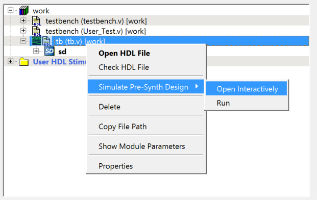

# Creating a new PolarFire SoC Project

Use the MSS standalone configurator tool and Libero® SoC to create MSS-based  designs. For more information, see the [Standalone MSS Configurator User Guide for PolarFire SoC](https://coredocs.s3.amazonaws.com/Libero/2025_1/pfsoc_mss_configurator_ug.pdf).

1.  Create the MSS configurator using the `pfsoc_mss` application by either creating a new configuration \(`.cfg`\) file or by opening an existing one.

2.  Configure the MSS subsystem with the required FIC interface and other necessary modules like DDR and Crypto.

3.  Generate the MSS component file \(`.cxz`\).

After finishing with the MSS standalone configuration, import the MSS subsystem into Libero, and then design the entire system, as follows:

1.  Open the Libero SoC Design Suite.
2.  Create the project.
3.  Invoke system builder to create your MSS block.
4.  Import the MSS component file.
5.  Design your entire system using MSS, AXI4 interconnect, fabric targets, and fabric initiators.
6.  After designing the entire system, check the DRC and generate the system.
7.  Add supported BFM instructions in the BFM files created in project.
8.  Add required test bench to perform simulation.
9.  Launch the Pre-Synth simulation.

    

