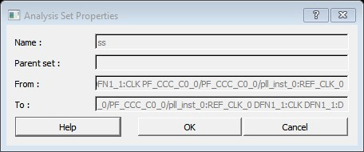

# Analysis Set Properties Dialog Box

Use the Analysis Set Properties dialog box to view information about a user-created set.

To open the Analysis Set Properties dialog box from the Timing Analysis View, right-click a  user-created set in the Domain Browser, and then choose  **Properties** from the shortcut menu.

-   **[Name](GUID-A6288B6C-C9B1-4A33-9FC8-5558D9C42D16.md)**  

-   **[Parent Set](GUID-AD9B78AE-659B-4413-81FA-4A4F85C604F6.md)**  

-   **[Creation Filter](GUID-A3426484-3F7F-495B-8150-2DA01029DE35.md)**  

-   **[To](GUID-5F61ED9E-6B01-417D-B7CD-BC64C3175558.md)**  

**Parent topic:**[SmartTime Dialog Boxes](GUID-F96D2B4E-7DDD-4507-8621-C49A84F55C81.md)

