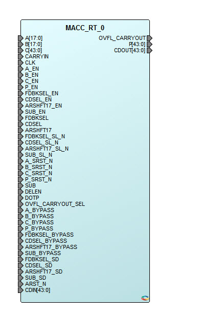

# MACC

## MACC

18-bit x 18-bit multiply-accumulate MACC block. The MACC block can accumulate  the current multiplication product with a previous result, a constant, a dynamic value,  or a result from another MACC block. Each MACC block can also be configured to perform a  Dot-product operation. All the signals of the MACC block \(except CDIN and CDOUT\) have  optional registers.

<table id="ID-0000084C"><thead><tr id="ID-00000858"><th id="ID-00000859">

Port Name

</th><th id="ID-0000085B">

Direction

</th><th id="ID-0000085D">

Type

</th><th id="ID-0000085F">

Polarity

</th><th id="ID-00000861">

Description

</th></tr></thead><tbody><tr id="ID-00000864"><td id="ID-00000865">

DOTP

</td><td id="ID-00000867">

Input

</td><td id="ID-00000869">

Static

</td><td id="ID-0000086B">

High

</td><td id="ID-0000086D">

Dot-product mode. -   When DOTP = 1, MACC block performs Dot-product of two pairs of 9-bit operands.
-   When DOTP = 0, it is called the normal mode.

</td></tr><tr id="ID-00000871"><td id="ID-00000872">

SIMD

</td><td id="ID-00000874">

Input

</td><td id="ID-00000876">

Static

</td><td id="ID-00000878">

—

</td><td id="ID-0000087A">

Reserved. Must be 0.

</td></tr><tr id="ID-0000087C"><td id="ID-0000087D">

OVFL\_CARRYOUT\_SEL

</td><td id="ID-0000087F">

Input

</td><td id="ID-00000881">

Static

</td><td id="ID-00000883">

High

</td><td id="ID-00000885">

Generate OVERFLOW or CARRYOUT with result P.OVERFLOW when OVFL\_CARRYOUT\_SEL = 0CARRYOUT when OVFL\_CARRYOUT\_SEL = 1

</td></tr><tr id="ID-0000088E"><td id="ID-0000088F">

CLK\[1:0\]

</td><td id="ID-00000892">

Input

</td><td id="ID-00000894">

Dynamic

</td><td id="ID-00000896">

Rising edge

</td><td id="ID-00000898">

Input clocks.CLK\[1\] is the clock for A\[17:9\], B\[17:9\], C\[43:18\], P\[43:18\], OVFL\_CARRYOUT, ARSHFT17, CDSEL, FDBKSEL and SUB registers.CLK\[0\] is the clock for A\[8:0\], B\[8:0\], C\[17:0\], CARRYIN and P\[17:0\].In normal mode, ensure CLK\[1\] = CLK\[0\].

</td></tr><tr id="ID-000008A2"><td id="ID-000008A3">

A\[17:0\]

</td><td id="ID-000008A6">

Input

</td><td id="ID-000008A8">

Dynamic

</td><td id="ID-000008AA">

High

</td><td id="ID-000008AC">

Input data A.

</td></tr><tr id="ID-000008AE"><td id="ID-000008AF">

A\_BYPASS\[1:0\]

</td><td id="ID-000008B1">

Input

</td><td id="ID-000008B3">

Static

</td><td id="ID-000008B5">

High

</td><td id="ID-000008B7">

Bypass data A registers.A\_BYPASS\[1\] is for A\[17:9\]. Connect to 1, if not registered.A\_BYPASS\[0\] is for A\[8:0\]. Connect to 1, if not registered.In normal mode, ensure 
A\_BYPASS\[0\] = A\_BYPASS\[1\].

</td></tr><tr id="ID-000008BE"><td id="ID-000008BF">

A\_ARST\_N\[1:0\]

</td><td id="ID-000008C1">

Input

</td><td id="ID-000008C3">

Dynamic

</td><td id="ID-000008C5">

Low

</td><td id="ID-000008C7">

Asynchronous reset for data A registers.Connect both A\_ARST\_N\[1\] and = A\_ARST\_N\[0\] to 1 or to the global Asynchronous reset of the design

</td></tr><tr id="ID-000008CA"><td id="ID-000008CB">

A\_SRST\_N\[1:0\]

</td><td id="ID-000008CD">

Input

</td><td id="ID-000008CF">

Dynamic

</td><td id="ID-000008D1">

Low

</td><td id="ID-000008D3">

Synchronous reset for data A registers.A\_SRST\_N\[1\] is for A\[17:9\]. Connect to 1, if not registered.A\_SRST\_N\[0\] is for A\[8:0\]. Connect to 1, if not registered.In normal mode, ensure 
A\_SRST\_N\[1\] = A\_SRST\_N\[0\].

</td></tr><tr id="ID-000008DA"><td id="ID-000008DB">

A\_EN\[1:0\]

</td><td id="ID-000008DD">

Input

</td><td id="ID-000008DF">

Dynamic

</td><td id="ID-000008E1">

High

</td><td id="ID-000008E3">

Enable for data A registers.A\_EN\[1\] is for A\[17:9\]. Connect to 1, if not registered.A\_EN\[0\] is for A\[8:0\]. Connect to 1, if not registered.In normal mode, ensure A\_EN\[1\] = A\_EN\[0\].

</td></tr><tr id="ID-000008ED"><td id="ID-000008EE">

B\[17:0\]

</td><td id="ID-000008F1">

Input

</td><td id="ID-000008F3">

Dynamic

</td><td id="ID-000008F5">

High

</td><td id="ID-000008F7">

Input data B.

</td></tr><tr id="ID-000008F9"><td id="ID-000008FA">

B\_BYPASS\[1:0\]

</td><td id="ID-000008FC">

Input

</td><td id="ID-000008FE">

Static

</td><td id="ID-00000900">

High

</td><td id="ID-00000902">

Bypass data B registers.B\_BYPASS\[1\] is for B\[17:9\]. Connect to 1, if not registered.B\_BYPASS\[0\] is for B\[8:0\]. Connect to 1, if not registered.In normal mode, ensure 
B\_BYPASS\[0\] = B\_BYPASS\[1\].

</td></tr><tr id="ID-00000909"><td id="ID-0000090A">

B\_ARST\_N\[1:0\]

</td><td id="ID-0000090C">

Input

</td><td id="ID-0000090E">

Dynamic

</td><td id="ID-00000910">

Low

</td><td id="ID-00000912">

Asynchronous reset for data B registers.In normal mode, ensureConnect both B\_ARST\_N\[1\] and B\_ARST\_N\[0\] to 1 or to the global Asynchronous reset of the design.

</td></tr><tr id="ID-00000917"><td id="ID-00000918">

B\_SRST\_N\[1:0\]

</td><td id="ID-0000091A">

Input

</td><td id="ID-0000091C">

Dynamic

</td><td id="ID-0000091E">

Low

</td><td id="ID-00000920">

Synchronous reset for data B registers.B\_SRST\_N\[1\] is for B\[17:9\]. Connect to 1, if not registered.B\_SRST\_N\[0\] is for B\[8:0\]. Connect to 1, if not registered.In normal mode, ensure 
B\_SRST\_N\[1\] = B\_SRST\_N\[0\].

</td></tr><tr id="ID-00000927"><td id="ID-00000928">

B\_EN\[1:0\]

</td><td id="ID-0000092A">

Input

</td><td id="ID-0000092C">

Dynamic

</td><td id="ID-0000092E">

High

</td><td id="ID-00000930">

Enable for data B registers.B\_EN\[1\] is for B\[17:9\]. Connect to 1, if not registered.B\_EN\[0\] is for B\[8:0\]. Connect to 1, if not registered.In normal mode, ensure B\_EN\[1\] = B\_EN\[0\].

</td></tr><tr id="ID-0000093A"><td id="ID-0000093B">

P\[43:0\]

</td><td id="ID-0000093E">

Output

</td><td id="ID-00000940">

—

</td><td id="ID-00000942">

High

</td><td id="ID-00000944">

Result data.Normal modeP = D + \(CARRYIN + C\) + \(A \* B\), when SUB = 0P = D + \(CARRYIN + C\) - \(A \* B\), when SUB = 1Dot-product modeP = D + \(CARRYIN + C\) + 512 \* \(\(AL \* BH\) + \(AH \* BL\)\), when SUB = 0P = D + \(CARRYIN + C\) - 512 \* \(\(AL \* BH\) + \(AH \* BL\)\), when SUB = 1Notation:AL = A\[8:0\], AH = A\[17:9\]BL = B\[8:0\], BH = B\[17:9\]Refer to Table 5-4 to see how operand D is obtained from P, CDIN or 0.

</td></tr><tr id="ID-00000963"><td id="ID-00000964">

OVFL\_CARRYOUT

</td><td id="ID-00000966">

Output

</td><td id="ID-00000968">

—

</td><td id="ID-0000096A">

High

</td><td id="ID-0000096C">

Overflow or CarryOutRefer to Table 5-5.

</td></tr><tr id="ID-00000970"><td id="ID-00000971">

P\_BYPASS\[1:0\]

</td><td id="ID-00000973">

Input

</td><td id="ID-00000975">

Static

</td><td id="ID-00000977">

High

</td><td id="ID-00000979">

Bypass result P registers.P\_BYPASS\[1\] is for P\[43:18\] and OVFL\_CARRYOUT. Connect to 1, if not registered.P\_BYPASS\[0\] is for P\[17:0\]. Connect to 1, if not registered.In normal mode, ensure 
P\_BYPASS\[0\] = P\_BYPASS\[1\].

</td></tr><tr id="ID-00000980"><td id="ID-00000981">

P\_ARST\_N\[1:0\]

</td><td id="ID-00000983">

Input

</td><td id="ID-00000985">

Dynamic

</td><td id="ID-00000987">

Low

</td><td id="ID-00000989">

Asynchronous reset for P and OVFL\_CARRYOUT registers.Connect both P\_ARST\_N\[1\] and P\_ARST\_N\[0\] to 1 or to the global Asynchronous reset of the design.

</td></tr><tr id="ID-0000098C"><td id="ID-0000098D">

P\_SRST\_N\[1:0\]

</td><td id="ID-0000098F">

Input

</td><td id="ID-00000991">

Dynamic

</td><td id="ID-00000993">

Low

</td><td id="ID-00000995">

Synchronous reset for result P registers.P\_SRST\_N\[1\] is for P\[43:18\] and OVFL\_CARRYOUT. Connect to 1, if not registered.P\_SRST\_N\[0\] is for P\[17:0\]. Connect to 1, if not registered.In normal mode, ensure 
P\_SRST\_N\[1\] = P\_SRST\_N\[0\].

</td></tr><tr id="ID-0000099C"><td id="ID-0000099D">

P\_EN\[1:0\]

</td><td id="ID-0000099F">

Input

</td><td id="ID-000009A1">

Dynamic

</td><td id="ID-000009A3">

High

</td><td id="ID-000009A5">

Enable for result P registers.P\_EN\[1\] is for P\[43:18\] and OVFL\_CARRYOUT. Connect to 1, if not registered.P\_EN\[0\] is for P\[17:0\]. Connect to 1, if not registered.In normal mode, ensure P\_EN\[1\] = P\_EN\[0\].

</td></tr><tr id="ID-000009AF"><td id="ID-000009B0">

CDOUT\[43:0\]

</td><td id="ID-000009B3">

Output

</td><td id="ID-000009B5">

Cascade

</td><td id="ID-000009B7">

High

</td><td id="ID-000009B9">

Cascade output of result P.CDOUT is the same as P. The entire bus must either be dangling or drive an entire CDIN of another MACC block in cascaded mode.

</td></tr><tr id="ID-000009BF"><td id="ID-000009C0">

CARRYIN

</td><td id="ID-000009C2">

Input

</td><td id="ID-000009C4">

Dynamic

</td><td id="ID-000009C6">

High

</td><td id="ID-000009C8">

CarryIn for operand C.

</td></tr><tr id="ID-000009CA"><td id="ID-000009CB">

C\[43:0\]

</td><td id="ID-000009CE">

Input

</td><td id="ID-000009D0">

Dynamic

</td><td id="ID-000009D2">

High

</td><td id="ID-000009D4">

Routed input for operand C.In Dot-product mode, connect C\[8:0\] to the CARRYIN.

</td></tr><tr id="ID-000009D7"><td id="ID-000009D8">

C\_BYPASS\[1:0\]

</td><td id="ID-000009DA">

Input

</td><td id="ID-000009DC">

Static

</td><td id="ID-000009DE">

High

</td><td id="ID-000009E0">

Bypass data C registers.C\_BYPASS\[1\] is for C\[43:18\]. Connect to 1, if not registered.C\_BYPASS\[0\] is for C\[17:0\] and CARRYIN. Connect to 1, if not registered.In normal mode, ensure 
C\_BYPASS\[0\] = C\_BYPASS\[1\].

</td></tr><tr id="ID-000009E7"><td id="ID-000009E8">

C\_ARST\_N\[1:0\]

</td><td id="ID-000009EA">

Input

</td><td id="ID-000009EC">

Dynamic

</td><td id="ID-000009EE">

Low

</td><td id="ID-000009F0">

Asynchronous reset for CARRYIN and C registers. Connect both C\_ARST\_N\[1\] and C\_ARST\_N\[0\] to 1 or to the global Asynchronous reset of the design.

</td></tr><tr id="ID-000009F4"><td id="ID-000009F5">

C\_SRST\_N\[1:0\]

</td><td id="ID-000009F7">

Input

</td><td id="ID-000009F9">

Dynamic

</td><td id="ID-000009FB">

Low

</td><td id="ID-000009FD">

Synchronous reset for data C registers.C\_SRST\_N\[1\] is for C\[43:18\]. Connect to 1, if not registered.C\_SRST\_N\[0\] is for C\[17:0\] and CARRYIN. Connect to 1, if not registered.In normal mode, ensure 
C\_SRST\_N\[1\] = C\_SRST\_N\[0\].

</td></tr><tr id="ID-00000A04"><td id="ID-00000A05">

C\_EN\[1:0\]

</td><td id="ID-00000A07">

Input

</td><td id="ID-00000A09">

Dynamic

</td><td id="ID-00000A0B">

High

</td><td id="ID-00000A0D">

Enable for data C registers.C\_EN\[1\] is for C\[43:18\]. Connect to 1, if not registered.C\_EN\[0\] is for C\[17:0\] and CARRYIN. Connect to 1, if not registered.In normal mode, ensure C\_EN\[1\] = C\_EN\[0\].

</td></tr><tr id="ID-00000A14"><td id="ID-00000A15">

CDIN\[43:0\]

</td><td id="ID-00000A17">

Input

</td><td id="ID-00000A19">

Cascade

</td><td id="ID-00000A1B">

High

</td><td id="ID-00000A1D">

Cascaded input for operand D.The entire bus must be driven by an entire CDOUT of another MACC block. In Dot-product mode the CDOUT must also be generated by a MACC block in Dot-product mode.Refer to Table 5-4 to see how CDIN is propagated to operand D.

</td></tr><tr id="ID-00000A25"><td id="ID-00000A26">

ARSHFT17

</td><td id="ID-00000A28">

Input

</td><td id="ID-00000A2A">

Dynamic

</td><td id="ID-00000A2C">

High

</td><td id="ID-00000A2E">

Arithmetic right-shift for operand D.When asserted, a 17-bit arithmetic right-shift is performed on operand D going into the accumulator.Refer to Table 5-4 to see how operand D is obtained from P, CDIN or 0.

</td></tr><tr id="ID-00000A33"><td id="ID-00000A34">

ARSHFT17\_BYPASS

</td><td id="ID-00000A36">

Input

</td><td id="ID-00000A38">

Static

</td><td id="ID-00000A3A">

High

</td><td id="ID-00000A3C">

Bypass ARSHFT17 register. Connect to 1, if not registered.

</td></tr><tr id="ID-00000A3E"><td id="ID-00000A3F">

ARSHFT17\_AL\_N

</td><td id="ID-00000A41">

Input

</td><td id="ID-00000A43">

Dynamic

</td><td id="ID-00000A45">

Low

</td><td id="ID-00000A47">

Asynchronous load for ARSHFT17 register.Connect to 1 or to the global Asynchronous reset of the design.When asserted, ARSHFT17 register is loaded with ARSHFT17\_AD.

</td></tr><tr id="ID-00000A4B"><td id="ID-00000A4C">

ARSHFT17\_AD

</td><td id="ID-00000A4E">

Input

</td><td id="ID-00000A50">

Static

</td><td id="ID-00000A52">

High

</td><td id="ID-00000A54">

Asynchronous load data for ARSHFT17 register.

</td></tr><tr id="ID-00000A56"><td id="ID-00000A57">

ARSHFT17\_SL\_N

</td><td id="ID-00000A59">

Input

</td><td id="ID-00000A5B">

Dynamic

</td><td id="ID-00000A5D">

Low

</td><td id="ID-00000A5F">

Synchronous load for ARSHFT17 register. Connect to 1, if not registered. See [Table 5-2](GUID-357E9DD3-6E46-4FA7-B80B-825CE77DC9C7.md#ID-00000B7F).

</td></tr><tr id="ID-00000A62"><td id="ID-00000A63">

ARSHFT17\_SD\_N

</td><td id="ID-00000A65">

Input

</td><td id="ID-00000A67">

Static

</td><td id="ID-00000A69">

Low

</td><td id="ID-00000A6B">

Synchronous load data for ARSHFT17 register. See [Table 5-2](GUID-357E9DD3-6E46-4FA7-B80B-825CE77DC9C7.md#ID-00000B7F).

</td></tr><tr id="ID-00000A6E"><td id="ID-00000A6F">

ARSHFT17\_EN

</td><td id="ID-00000A71">

Input

</td><td id="ID-00000A73">

Dynamic

</td><td id="ID-00000A75">

High

</td><td id="ID-00000A77">

Enable for ARSHFT17 register. Connect to 1, if not registered. See [Table 5-2](GUID-357E9DD3-6E46-4FA7-B80B-825CE77DC9C7.md#ID-00000B7F).

</td></tr><tr id="ID-00000A7D"><td id="ID-00000A7E">

CDSEL

</td><td id="ID-00000A80">

Input

</td><td id="ID-00000A82">

Dynamic

</td><td id="ID-00000A84">

High

</td><td id="ID-00000A86">

Select CDIN for operand D.When CDSEL = 1, propagate CDIN.When CDSEL = 0, propagate 0 or P depending on FDBKSEL.Refer to Table 5-4 to see how operand D is obtained from P, CDIN or 0.

</td></tr><tr id="ID-00000A8C"><td id="ID-00000A8D">

CDSEL\_BYPASS

</td><td id="ID-00000A8F">

Input

</td><td id="ID-00000A91">

Static

</td><td id="ID-00000A93">

High

</td><td id="ID-00000A95">

Bypass CDSEL register. Connect to 1, if not registered.

</td></tr><tr id="ID-00000A97"><td id="ID-00000A98">

CDSEL\_AL\_N

</td><td id="ID-00000A9A">

Input

</td><td id="ID-00000A9C">

Dynamic

</td><td id="ID-00000A9E">

Low

</td><td id="ID-00000AA0">

Asynchronous load for CDSEL register. Connect to 1 or to the global Asynchronous reset of the design.When asserted, CDSEL register is loaded with CDSEL\_AD.

</td></tr><tr id="ID-00000AA3"><td id="ID-00000AA4">

CDSEL\_AD

</td><td id="ID-00000AA6">

Input

</td><td id="ID-00000AA8">

Static

</td><td id="ID-00000AAA">

High

</td><td id="ID-00000AAC">

Asynchronous load data for CDSEL register.

</td></tr><tr id="ID-00000AAE"><td id="ID-00000AAF">

CDSEL\_SL\_N

</td><td id="ID-00000AB1">

Input

</td><td id="ID-00000AB3">

Dynamic

</td><td id="ID-00000AB5">

Low

</td><td id="ID-00000AB7">

Synchronous load for CDSEL register. Connect to 1, if not registered. See [Table 5-2](GUID-357E9DD3-6E46-4FA7-B80B-825CE77DC9C7.md#ID-00000B7F).

</td></tr><tr id="ID-00000ABA"><td id="ID-00000ABB">

CDSEL\_SD\_N

</td><td id="ID-00000ABD">

Input

</td><td id="ID-00000ABF">

Static

</td><td id="ID-00000AC1">

Low

</td><td id="ID-00000AC3">

Synchronous load data for CDSEL register. See [Table 5-2](GUID-357E9DD3-6E46-4FA7-B80B-825CE77DC9C7.md#ID-00000B7F).

</td></tr><tr id="ID-00000AC6"><td id="ID-00000AC7">

CDSEL\_EN

</td><td id="ID-00000AC9">

Input

</td><td id="ID-00000ACB">

Dynamic

</td><td id="ID-00000ACD">

High

</td><td id="ID-00000ACF">

Enable for CDSEL register. Connect to 1, if not registered. See [Table 5-2](GUID-357E9DD3-6E46-4FA7-B80B-825CE77DC9C7.md#ID-00000B7F).

</td></tr><tr id="ID-00000AD5"><td id="ID-00000AD6">

FDBKSEL

</td><td id="ID-00000AD8">

Input

</td><td id="ID-00000ADA">

Dynamic

</td><td id="ID-00000ADC">

High

</td><td id="ID-00000ADE">

Select the feedback from P for operand D.When FDBKSEL = 1, propagate the current value of result P register. Ensure P\_BYPASS\[1\] = 0 and CDSEL = 0.When FDBKSEL = 0, propagate 0. Ensure CDSEL = 0.Refer to Table 5-4 to see how operand D is obtained from P, CDIN or 0.

</td></tr><tr id="ID-00000AE4"><td id="ID-00000AE5">

FDBKSEL\_BYPASS

</td><td id="ID-00000AE7">

Input

</td><td id="ID-00000AE9">

Static

</td><td id="ID-00000AEB">

High

</td><td id="ID-00000AED">

Bypass FDBKSEL register. Connect to 1, if not registered.

</td></tr><tr id="ID-00000AEF"><td id="ID-00000AF0">

FDBKSEL\_AL\_N

</td><td id="ID-00000AF2">

Input

</td><td id="ID-00000AF4">

Dynamic

</td><td id="ID-00000AF6">

Low

</td><td id="ID-00000AF8">

Asynchronous load for FDBKSEL register. Connect to 1 or to the global Asynchronous reset of the design.When asserted, FDBKSEL register is loaded with FDBKSEL\_AD.

</td></tr><tr id="ID-00000AFB"><td id="ID-00000AFC">

FDBKSEL\_AD

</td><td id="ID-00000AFE">

Input

</td><td id="ID-00000B00">

Static

</td><td id="ID-00000B02">

High

</td><td id="ID-00000B04">

Asynchronous load data for FDBKSEL register.

</td></tr><tr id="ID-00000B06"><td id="ID-00000B07">

FDBKSEL\_SL\_N

</td><td id="ID-00000B09">

Input

</td><td id="ID-00000B0B">

Dynamic

</td><td id="ID-00000B0D">

Low

</td><td id="ID-00000B0F">

Synchronous load for FDBKSEL register. Connect to 1, if not registered. See [Table 5-2](GUID-357E9DD3-6E46-4FA7-B80B-825CE77DC9C7.md#ID-00000B7F).

</td></tr><tr id="ID-00000B12"><td id="ID-00000B13">

FDBKSEL\_SD\_N

</td><td id="ID-00000B15">

Input

</td><td id="ID-00000B17">

Static

</td><td id="ID-00000B19">

Low

</td><td id="ID-00000B1B">

Synchronous load data for FDBKSEL register. See [Table 5-2](GUID-357E9DD3-6E46-4FA7-B80B-825CE77DC9C7.md#ID-00000B7F).

</td></tr><tr id="ID-00000B1E"><td id="ID-00000B1F">

FDBKSEL\_EN

</td><td id="ID-00000B21">

Input

</td><td id="ID-00000B23">

Dynamic

</td><td id="ID-00000B25">

High

</td><td id="ID-00000B27">

Enable for FDBKSEL register. Connect to 1, if not registered. See [Table 5-2](GUID-357E9DD3-6E46-4FA7-B80B-825CE77DC9C7.md#ID-00000B7F).

</td></tr><tr id="ID-00000B2D"><td id="ID-00000B2E">

SUB

</td><td id="ID-00000B30">

Input

</td><td id="ID-00000B32">

Dynamic

</td><td id="ID-00000B34">

High

</td><td id="ID-00000B36">

Subtract operation.

</td></tr><tr id="ID-00000B38"><td id="ID-00000B39">

SUB\_BYPASS

</td><td id="ID-00000B3B">

Input

</td><td id="ID-00000B3D">

Static

</td><td id="ID-00000B3F">

High

</td><td id="ID-00000B41">

Bypass SUB register. Connect to 1, if not registered.

</td></tr><tr id="ID-00000B43"><td id="ID-00000B44">

SUB\_AL\_N

</td><td id="ID-00000B46">

Input

</td><td id="ID-00000B48">

Dynamic

</td><td id="ID-00000B4A">

Low

</td><td id="ID-00000B4C">

Asynchronous load for SUB register.Connect to 1 or to the global Asynchronous reset of the design.When asserted, SUB register is loaded with SUB\_AD.

</td></tr><tr id="ID-00000B50"><td id="ID-00000B51">

SUB\_AD

</td><td id="ID-00000B53">

Input

</td><td id="ID-00000B55">

Static

</td><td id="ID-00000B57">

High

</td><td id="ID-00000B59">

Asynchronous load data for SUB register.

</td></tr><tr id="ID-00000B5B"><td id="ID-00000B5C">

SUB\_SL\_N

</td><td id="ID-00000B5E">

Input

</td><td id="ID-00000B60">

Dynamic

</td><td id="ID-00000B62">

Low

</td><td id="ID-00000B64">

Synchronous load for SUB register. Connect to 1, if not registered. See [Table 5-2](GUID-357E9DD3-6E46-4FA7-B80B-825CE77DC9C7.md#ID-00000B7F).

</td></tr><tr id="ID-00000B67"><td id="ID-00000B68">

SUB\_SD\_N

</td><td id="ID-00000B6A">

Input

</td><td id="ID-00000B6C">

Static

</td><td id="ID-00000B6E">

Low

</td><td id="ID-00000B70">

Synchronous load data for SUB register. See [Table 5-2](GUID-357E9DD3-6E46-4FA7-B80B-825CE77DC9C7.md#ID-00000B7F).

</td></tr><tr id="ID-00000B73"><td id="ID-00000B74">

SUB\_EN

</td><td id="ID-00000B76">

Input

</td><td id="ID-00000B78">

Dynamic

</td><td id="ID-00000B7A">

High

</td><td id="ID-00000B7C">

Enable for SUB register. Connect to 1, if not registered. See [Table 5-2](GUID-357E9DD3-6E46-4FA7-B80B-825CE77DC9C7.md#ID-00000B7F).

</td></tr></tbody>
</table>|\_AL\_N|\_AD|\_BYPASS|\_CLK|\_EN|\_SL\_N|\_SD\_N|D|Qn+1|
|-------|----|--------|-----|----|-------|-------|---|----|
|0|AD|X|X|X|X|X|X|AD|
|1|X|0|Not rising|X|X|X|X|Qn|
|1|X|0|—|0|X|X|X|Qn|
|1|X|0|—|1|0|SDn|X|!SDn|
|1|X|0|—|1|1|X|D|D|
|1|X|1|X|0|X|X|X|Qn|
|1|X|1|X|1|0|SDn|X|!SDn|
|1|X|1|X|1|1|X|D|D|

|\_ARST\_N|\_BYPASS|\_CLK|\_EN|\_SRST\_N|D|Qn+1|
|---------|--------|-----|----|---------|---|----|
|0|X|X|X|X|X|0|
|1|0|Not rising|X|X|X|Qn|
|1|0|—|0|X|X|Qn|
|1|0|—|1|0|X|0|
|1|0|—|1|1|D|D|
|1|1|X|0|X|X|Qn|
|1|1|X|1|0|X|0|
|1|1|X|1|1|D|D|

|FDBKSEL|CDSEL|ARSHFT17|Operand D|
|-------|-----|--------|---------|
|0|0|x|44'b0|
|x|1|0|CDIN\[43:0\]|
|x|1|1|\{\{17\{CDIN\[43\]\}\},CDIN\[43:17\]\}|
|1|0|0|P\[43:0\]|
|1|0|1|\{\{17\{P\[43\]\}\},P\[43:17\]\}|

|OVFL\_CARRYOUT\_SEL|OVFL\_CARRYOUT|Description|
|-------------------|--------------|-----------|
|0|\(SUM\[45\] ^ SUM\[44\) \| \(SUM\[44\] ^ SUM\[43\]\)|True if overflow or underflow occurred.|
|1|C\[43\] ^ D\[43\] ^ SUM\[44\]|A signal that can be used to extend the final adder in the fabric.|

SUM\[45:0\] is defined similarly to P\[43:0\], except that SUM is a 46-bit quantity so that no overflow can occur. SUM\[44\] is the carry out bit of a 44-bit final adder producing P\[43:0\].

## MACC\_RT

18 bit x 18 bit multiply-accumulate MACC\_RT block.

The MACC\_RT block can accumulate the current multiplication product with a  previous result, a constant, a dynamic value, or a result from another MACC\_RT block. Each  MACC\_RT block can also be configured to perform a Dot-product operation. All the signals of  the MACC\_RT block \(except CDIN and CDOUT\) have optional registers.

|Port Name|Direction|Type|Polarity|Description|
|---------|---------|----|--------|-----------|
|DOTP|Input|Static|High|Dot-product mode.When  DOTP = 1, MACC\_RT block performs Dot-product of two pairs of 9-bit  operands.When DOTP = 0, it is called the normal  mode.|
|OVFL\_CARRYOUT\_SEL|Input|Static|High|Generate OVERFLOW or CARRYOUT with result  P.OVERFLOW when OVFL\_CARRYOUT\_SEL = 0CARRYOUT when OVFL\_CARRYOUT\_SEL = 1|
|DELEN|Input|Static|High|Enable Single-event Transient  mitigation|
|CLK|Input|Dynamic|Rising edge|Input clocks.CLK is the  clock for A\[17:0\], B\[17:0\], C\[43:0\], P\[43:0\], OVFL\_CARRYOUT, ARSHFT17,  CDSEL, FDBKSEL and SUB registers.|
|ARST\_N|Input|Dynamic|Low|Asynchronous reset for all registers|
|A\[17:0\]|Input|Dynamic|High|Input data A.|
|A\_BYPASS|Input|Static|High|Bypass data A registers.Connect to 1, if not registered.|
|A\_SRST\_N|Input|Dynamic|Low|Synchronous reset for data A registers.Connect to 1, if not registered.|
|A\_EN|Input|Dynamic|High|Enable for data A registers.Connect to 1, if not registered.|
|B\[17:0\]|Input|Dynamic|High|Input data B.|
|B\_BYPASS|Input|Static|High|Bypass data B registers.Connect to 1, if not registered.|
|B\_SRST\_N|Input|Dynamic|Low|Synchronous reset for data B registers.Connect to 1, if not registered.|
|B\_EN|Input|Dynamic|High|Enable for data B registers.Connect to 1, if not registered.|
|P\[43:0\]|Output|—|High|Result data.Normal  modeP = D + \(CARRYIN + C\) + \(A \* B\), when SUB =  0P = D + \(CARRYIN + C\) - \(A \* B\), when SUB = 1Dot-product modeP = D + \(CARRYIN +  C\) + 512 \* \(\(AL \* BH\) + \(AH \* BL\)\), when SUB = 0P = D + \(CARRYIN + C\) - 512  \* \(\(AL \* BH\) +  \(AH \* BL\)\), when  SUB = 1Notation:AL = A\[8:0\], AH =  A\[17:9\]BL = B\[8:0\],  BH = B\[17:9\]Refer to  Table 5-4 to see how operand D is obtained from P,  CDIN or 0.|
|OVFL\_CARRYOUT|Output| |High|Overflow or CarryOutRefer  to Table 5-5.|
|P\_BYPASS|Input|Static|High|Bypass P and OVFL\_CARRYOUT registers.Connect to 1, if not registered.|
|P\_SRST\_N|Input|Dynamic|Low|Synchronous reset for P and OVFL\_CARRYOUT  registers.Connect to 1, if not registered.|
|P\_EN|Input|Dynamic|High|Enable for P and OVFL\_CARRYOUT registers.Connect to 1, if not registered.|
|CDOUT\[43:0\]|Output|Cascade|High|Cascade output of result P.CDOUT is the same as P. The entire bus must either be  dangling or drive an entire CDIN of another MACC\_RT block in cascaded  mode.|
|CARRYIN|Input|Dynamic|High|CarryIn for operand C.|
|C\[43:0\]|Input|Dynamic|High|Routed input for operand C.In Dot-product mode, connect C\[8:0\] to the  CARRYIN.|
|C\_BYPASS|Input|Static|High|Bypass CARRYIN and C registers.Connect to 1, if not registered.|
|C\_SRST\_N|Input|Dynamic|Low|Synchronous reset for CARRYIN and C  registers.Connect to 1, if not registered.|
|C\_EN|Input|Dynamic|High|Enable for CARRYIN and C registers.Connect to 1, if not registered.|
|CDIN\[43:0\]|Input|Cascade|High|Cascaded input for operand D.The entire bus must be driven by an entire CDOUT of another  MACC\_RT block. In Dot-product mode the CDOUT must also be generated by a  MACC\_RT block in Dot-product mode.Refer to Table 5-4 to see how CDIN is propagated to operand D.|
|ARSHFT17|Input|Dynamic|High|Arithmetic right-shift for operand D.When asserted, a 17-bit arithmetic right-shift is performed  on operand D going into the accumulator.Refer to  Table 5-4 to see how operand D is obtained from P, CDIN or  0.|
|ARSHFT17\_BYPASS|Input|Static|High|Bypass ARSHFT17 register. Connect to 1, if  not registered.|
|ARSHFT17\_SL\_N|Input|Dynamic|Low|Synchronous load for ARSHFT17 register.  Connect to 1, if not registered. See [Table 5-7](GUID-357E9DD3-6E46-4FA7-B80B-825CE77DC9C7.md#ID-00000FCA).|
|ARSHFT17\_SD|Input|Static|High|Synchronous load data for ARSHFT17 register.  See [Table 5-7](GUID-357E9DD3-6E46-4FA7-B80B-825CE77DC9C7.md#ID-00000FCA).|
|ARSHFT17\_EN|Input|Dynamic|High|Enable for ARSHFT17 register. Connect to 1,  if not registered. See [Table 5-7](GUID-357E9DD3-6E46-4FA7-B80B-825CE77DC9C7.md#ID-00000FCA).|
|CDSEL|Input|Dynamic|High|Select CDIN for operand D.When CDSEL = 1, propagate CDIN.When CDSEL = 0,  propagate 0 or P depending on FDBKSEL.Refer to Table 5-4 to see how operand D is obtained from P, CDIN or  0.|
|CDSEL\_BYPASS|Input|Static|High|Bypass CDSEL register. Connect to 1, if not  registered.|
|CDSEL\_SL\_N|Input|Dynamic|Low|Synchronous load for CDSEL register. Connect  to 1, if not registered. See [Table 5-7](GUID-357E9DD3-6E46-4FA7-B80B-825CE77DC9C7.md#ID-00000FCA).|
|CDSEL\_SD|Input|Static|High|Synchronous load data for CDSEL register. See  [Table 5-7](GUID-357E9DD3-6E46-4FA7-B80B-825CE77DC9C7.md#ID-00000FCA).|
|CDSEL\_EN|Input|Dynamic|High|Enable for CDSEL register. Connect to 1, if  not registered. See [Table 5-7](GUID-357E9DD3-6E46-4FA7-B80B-825CE77DC9C7.md#ID-00000FCA).|
|FDBKSEL|Input|Dynamic|High|Select the feedback from P for operand D.When FDBKSEL = 1, propagate the current value of result P  register. Ensure P\_BYPASS = 0 and CDSEL = 0.When  FDBKSEL = 0, propagate 0. Ensure CDSEL = 0.Refer to  Table 5-4 to see how operand D is obtained from P, CDIN or  0.|
|FDBKSEL\_BYPASS|Input|Static|High|Bypass FDBKSEL register. Connect to 1, if not  registered.|
|FDBKSEL\_SL\_N|Input|Dynamic|Low|Synchronous load for FDBKSEL register.  Connect to 1, if not registered. See [Table 5-7](GUID-357E9DD3-6E46-4FA7-B80B-825CE77DC9C7.md#ID-00000FCA).|
|FDBKSEL\_SD|Input|Static|High|Synchronous load data for FDBKSEL register.  See [Table 5-7](GUID-357E9DD3-6E46-4FA7-B80B-825CE77DC9C7.md#ID-00000FCA).|
|FDBKSEL\_EN|Input|Dynamic|High|Enable for FDBKSEL register. Connect to 1, if  not registered. See [Table 5-7](GUID-357E9DD3-6E46-4FA7-B80B-825CE77DC9C7.md#ID-00000FCA).|
|SUB|Input|Dynamic|High|Subtract operation.|
|SUB\_BYPASS|Input|Static|High|Bypass SUB register. Connect to 1, if not  registered.|
|SUB\_SL\_N|Input|Dynamic|Low|Synchronous load for SUB register. Connect to  1, if not registered. See [Table 5-7](GUID-357E9DD3-6E46-4FA7-B80B-825CE77DC9C7.md#ID-00000FCA).|
|SUB\_SD|Input|Static|High|Synchronous load data for SUB register. See  [Table 5-7](GUID-357E9DD3-6E46-4FA7-B80B-825CE77DC9C7.md#ID-00000FCA).|
|SUB\_EN|Input|Dynamic|High|Enable for SUB register. Connect to 1, if not  registered. See [Table 5-7](GUID-357E9DD3-6E46-4FA7-B80B-825CE77DC9C7.md#ID-00000FCA).|

|ARST\_N|\_BYPASS|\_CLK|\_EN|\_SL\_N|\_SD|D|Qn+1|
|-------|--------|-----|----|-------|----|---|----|
|0|X|X|X|X|X|X|0|
|1|0|Not rising|X|X|X|X|Qn|
|1|0|—|0|X|X|X|Qn|
|1|0|—|1|0|SDn|X|SDn|
|1|0|—|1|1|X|D|D|
|1|1|X|0|X|X|X|Qn|
|1|1|X|1|0|SDn|X|SDn|
|1|1|X|1|1|X|D|D|

