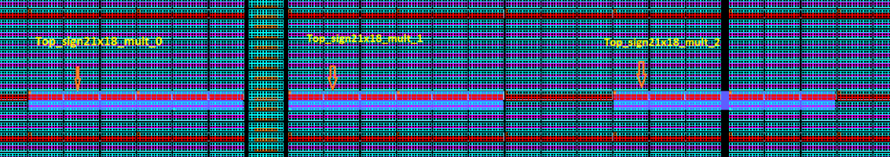

# Checking Cascaded Math Block Instance Adherence to the Separation Criteria

MSVT checks if all of the cascaded Math block instances adhere to the separation criteria. If there are any cascaded Math block instances that violate the separation criteria, then they are listed in the `Input signals of the following Math block instances can be observed by failure of config switches in cascade chain` section of the report.

## Design Example

The following is a chip planner snap shot of a design in which `Top_sign21x18_mult_0`, `Top_sign21x18_mult_1` and `Top_sign21x18_mult_2` are three Math blocks.`Top_sign21x18_mult_0` is adjacent to `Top_sign21x18_mult_1`, whereas `Top_sign21x18_mult_2` is separated by `Top_sign21x18_mult_1` with one `MATH` cluster.



## MSVT Output Report

Because `Top_sign21x18_mult_0` is adjacent to `Top_sign21x18_mult_1`, MSVT fails and reports an error for these `MACC` instances, as shown in the following. However, as`Top_sign21x18_mult_2` is separated from `Top_sign21x18_mult_1` by at least one `MATH` cluster, it is not identified as an error by MSVT, as shown in following report section example.

## Input signals of the following Math block instances can be observed by failure of the config switches in the cascade chain

```
-----------------------------------------------------------------------------------------------------------------------------------------
Input signals of the following Math block instances can be observed by failure of the config switches in the cascade chain: ================================================================================================================== Block1_rom_0/macc_rom_top/MACC_PA_BC_ROM_5/MACC_PHYS_0/INST_MACC_IP of block Block1_rom_0 can be observed by Math block instance Block0_0/block0_level_0/MACC_PA_8/MACC_PHYS_INST/INST_MACC_IP of block Block0_0
-----------------------------------------------------------------------------------------------------------------------------------------
```

**Parent topic:**[MSVT Report Sections](GUID-85B5B29F-544B-4AC0-A737-2C4A3FBB1A97.md)

